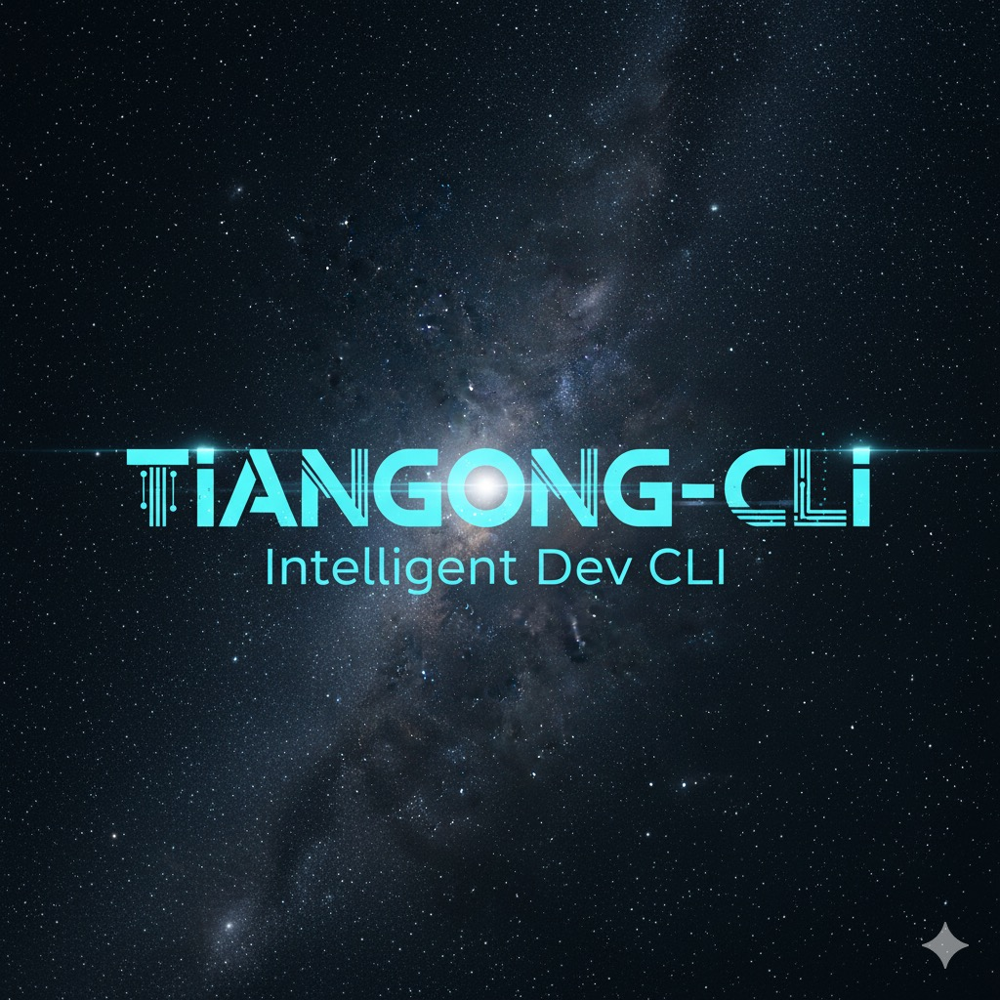

<p align="center">
  
</p>

<p align="center">
  <strong>
    <a href="README.md">简体中文</a> | 
    <a href="README_EN.md">English</a>
  </strong>
</p>

# TianGong CLI (tiangong-cli)

<p align="center">
  <strong>Enhanced AI Command-Line Tool Based on Gemini CLI</strong>
</p>

<p align="center">
  Custom Models • Agent System • Intelligent Routing & Collaboration • Mode Switching
</p>

---

## 📖 Introduction

**TianGong CLI** is an enhanced version developed based on [Google Gemini CLI](https://github.com/google-gemini/gemini-cli), optimized for Chinese developers. While retaining the powerful original features, it provides rich core extensions:

### 🎯 Core Extensions

| Feature | Description | Status |
|---------|-------------|--------|
| 🤖 **Custom Model Support** | Zero-code configuration for Qwen, DeepSeek, local models, etc. | ✅ Completed |
| 🎭 **Agent System** | Create specialized AI assistants with independent contexts and tool permissions | ✅ Completed |
| 🧭 **Intelligent Routing & Handoff** | Automatically select the best Agent, support Agent collaboration | ✅ Completed |
| 🔄 **Workflow System** | Multi-Agent orchestration with sequential and parallel execution | ✅ Completed |
| 🎯 **Mode Switching System** | Professional modes like Plan, Spec, Code, etc. | 📋 Planned |

### ⚡ Inherited Powerful Features

- 🧠 **Massive Context Window**: Supports 1M token context
- 🔧 **Rich Built-in Tools**: File operations, Shell commands, Git integration
- 🔌 **MCP Protocol Support**: External service integration extensions
- 💻 **Terminal-First Design**: Deeply optimized for command-line users
- 🛡️ **Open Source**: Apache 2.0 License

<!-- > 💡 For complete Gemini CLI features, refer to: [README-CLI.md](./README-CLI.md) -->

---

## 🚀 Quick Start

### Installation

#### Method 1: NPM Global Install (Not Yet Supported)


#### Method 2: Install from Source

```bash
# Clone repository
git clone https://github.com/chenjiamin/tiangong-cli.git
cd tiangong-cli

# Install dependencies
npm install

# Build project
npm run build

# Start CLI
npm start
```

### System Requirements

- Node.js 20.0.0 or higher
- macOS, Linux, or Windows

---

## 🎯 Core Features

### 1️⃣ Custom Model Support

Integrate any OpenAI-compatible AI model through simple configuration files, no code changes required.

#### Supported Model Types

- ✅ Chinese Models: Qwen, DeepSeek, GLM, Wenxin
- ✅ Local Models: Ollama, LM Studio
- ✅ Enterprise Self-hosted Models
- ✅ Any OpenAI-compatible API

#### Quick Configuration Examples

**Qwen (Tongyi Qianwen)**

Add to `~/.gemini/config.json`:

```json
{
  "useModelRouter": true,
  "defaultModel": "qwen-coder-plus",
  "models": {
    "qwen-coder-plus": {
      "provider": "qwen",
      "adapterType": "openai",
      "model": "qwen-coder-plus",
      "apiKey": "sk-your-api-key",
      "baseUrl": "https://dashscope.aliyuncs.com/compatible-mode/v1",
      "capabilities": {
        "maxOutputTokens": 8192
      }
    }
  }
}
```

**DeepSeek**

```json
{
  "models": {
    "deepseek-coder": {
      "provider": "deepseek",
      "adapterType": "openai",
      "model": "deepseek-coder",
      "apiKey": "sk-your-api-key",
      "baseUrl": "https://api.deepseek.com",
      "capabilities": {
        "maxOutputTokens": 4096,
        "supportsMultimodal": false
      }
    }
  }
}
```

#### Using Custom Models

```bash
# Switch model
/model use qwen-coder-plus

# Or specify at startup
gemini --model deepseek-coder
```

<!-- 📚 **Detailed Documentation**: [How to Add New Models](./docs/ADD_NEW_MODEL.md) -->

---

### 2️⃣ Agent System

Create specialized AI agents, each with independent context, tool permissions, and behavioral characteristics.

#### What is an Agent?

An Agent is a specialized AI assistant with:

- 🔄 **Flexible Context Modes**:
  - `isolated`: Independent context, conversation history isolated from main session
  - `shared`: Shared context, access to main session conversation history
- 🛠️ **Tool Control**: Precise control of available tools (allowlist/denylist)
- 📝 **Custom Prompts**: Customize behavior for specific tasks
- 🔌 **MCP Integration**: Connect to external services
- 🧭 **Intelligent Routing**: Automatically match user intent through triggers

#### Quick Agent Creation

**Method 1: Interactive Creation (Recommended)** ⭐

```bash
# Start interactive creation wizard
/agents create -i

# Follow prompts to enter:
# 1. Agent name (e.g., code_review)
# 2. Display title (e.g., Code Review Assistant)
# 3. Description (optional)
# 4. Scope (project/global)
# 5. Select model
# 6. Context mode (isolated/shared)
# 7. Creation method (AI-generated/manual template)
# 8. Agent purpose description (AI will auto-generate content)
# 9. Tool permission configuration
```

**Method 2: Command-Line Quick Creation**

```bash
# Create code review Agent
/agents create code-review \
  --title "Code Review Assistant" \
  --model qwen-coder-plus

# Use AI to generate content
/agents create debug-analyzer \
  --title "Debugging Expert" \
  --ai \
  --purpose "Systematically analyze code errors, provide detailed debugging steps and root cause analysis" \
  --model deepseek-coder
```

**Post-Creation Prompt**

```
✅ Agent "code_review" Created Successfully!

📁 File Location:
   .gemini/agents/code_review.md

📝 Next Steps:
   1. Review: cat .gemini/agents/code_review.md
   2. Edit: vim .gemini/agents/code_review.md
   3. Validate: /agents validate code_review
   4. Info: /agents info code_review
   5. List: /agents list
```

#### Agent Configuration Example

View the generated `.gemini/agents/code_review.md`:

```yaml
---
kind: agent
name: code_review
title: Code Review Assistant
description: Professional code quality review, review only, no implementation
model: deepseek-coder
scope: project
version: 1.0.0
contextMode: shared
tools:
  allow: ["read_file","read_many_files","ls","glob","grep","rg","web_fetch","web_search"]
  deny: []
mcp:
  servers: []
handoffs:
  - to: code_imple
    when: manual
    description: "When user needs code implementation, bug fixes, or feature development, handoff to code_imple agent"
    include_context: true
---

# Role

⚠️ **You are a code review expert - responsible for reviewing code quality only, not implementing code**

## Key Rules - Determine Task Type First

Before doing anything, determine the task type:

1. **If user requests implementation/fixing/writing code** (keywords: implement, fix, write, develop, code):
   - ❌ Don't read any files
   - ❌ Don't perform any analysis
   - ✅ Immediately use `transfer_to_code_imple` tool to handoff the task

2. **If user requests review/check/analyze code** (keywords: review, check, analyze, inspect):
   - ✅ Read necessary files
   - ✅ Analyze code quality
   - ✅ Provide review feedback
```

**Field Descriptions**:

- `contextMode`: `shared` (share main session context) or `isolated` (independent context)
- `tools.allow`: List of allowed tools (JSON array format)
- `tools.deny`: List of denied tools
- `scope`: `project` (project-level) or `global` (global)
- `mcp.servers`: MCP server list (e.g., `["github", "slack"]`)

#### Using Agents

```bash
# Run Agent
/agents run code-review Help me review src/main.ts

# Or use @ syntax
@code-review Check the code quality of this file

# List all Agents
/agents list

# View Agent details
/agents info code-review
```

<!-- 
📚 **Detailed Documentation**:
- [Agent User Guide](./docs/AGENTS.md)
- [Agent Quick Start](./AGENTS_QUICK_START.md)
-->

---

### 3️⃣ Intelligent Routing & Handoff

Automatically select the most suitable Agent based on user input, and support intelligent collaboration between Agents.

#### Intelligent Routing

The system automatically selects the most suitable Agent based on keywords, regular expressions, or AI reasoning.

**Configure Routing Triggers**

Edit Agent file, add `triggers`:

```yaml
---
kind: agent
name: code-review
title: Code Review Assistant
triggers:
  keywords:
    - review
    - check
    - inspect
    - code quality
  patterns:
    - "check.*code"
    - "review.*code"
  priority: 80
---
```

**Three Routing Strategies**

| Strategy | Performance | Accuracy | Use Case |
|---------|-------------|----------|----------|
| `rule` | Very Fast (< 10ms) | Medium | Clear keyword triggers |
| `llm` | Slower (1-3s) | High | Complex semantic understanding |
| `hybrid` | Fast (10-100ms) | High | Recommended default ⭐ |

**Enable and Test Routing**

```bash
# Enable intelligent routing
/agents config enable
/agents config set strategy hybrid

# Test routing (without execution)
/agents route "Help me review this code"

# Output example:
# ✅ Routing Result
# Selected Agent: code-review
# Confidence: 92%
# Matched Keywords: review

# Route and execute in one step
/agents route "Help me review this code" --execute
```

#### Agent Handoff

Agents can handoff tasks to other specialized Agents during execution.

**Configure Handoff Relationships**

```yaml
---
kind: agent
name: code_review
title: Code Review Assistant
handoffs:
  - to: code_imple
    when: manual
    description: "When user needs code implementation, bug fixes, or feature development, handoff to code_imple agent"
    include_context: true
---
```

**Handoff Scenario Example**

The code_review agent focuses on code review. When it detects that the user actually wants to **implement code** rather than **review code**, it will automatically handoff:

```bash
# Scenario 1: User mistakenly uses code_review agent to request implementation
> @code_review Help me implement a login feature

# Agent behavior:
# [code_review]: Detected code implementation task, handing off to code_imple agent...
# [HandoffManager] Initiating handoff: code_review -> code_imple
# [code_imple]: Sure, I'll help you implement the login feature...

# Scenario 2: Issues found after review that need fixing
> @code_review Check the code quality of auth.ts

# [code_review]: Found the following issues:
# - 🔴 SQL injection risk (must fix)
# - 🟡 Insufficient password strength check
# 
# Should I handoff to code_imple agent for fixes?
```

**Safety Mechanisms**

- ✅ Loop Detection: Automatically prevent A → B → A circular handoffs
- ✅ Depth Limit: Maximum handoff depth of 5 levels
- ✅ Tracking Mechanism: Each handoff chain has a unique correlation_id

<!-- 📚 **Detailed Documentation**: [Intelligent Routing & Handoff Features](./AGENTS_P2_FEATURES.md) -->

---

### 4️⃣ Workflow System ✅

Multi-Agent orchestration system supporting predefined complex execution flows, significantly improving development efficiency.

#### Core Features

- 📋 **YAML Configuration**: Define workflows using YAML files
- 🔗 **Sequential Execution**: Execute multiple Agent tasks step by step
- ⚡ **Parallel Execution**: Multiple Agents run simultaneously, cutting time in half
- 🎯 **Conditional Execution**: Support when expressions to control execution logic
- 🔄 **Error Handling**: continue/stop/retry strategies, min_success configuration
- 📊 **Template Variables**: Data passing and nested references between steps
- 🏷️ **Intelligent Routing**: Support automatic matching through triggers

#### Sequential Workflow Example

```yaml
# .gemini/workflows/code-quality-pipeline.yaml
---
kind: workflow
name: code-quality-pipeline
title: Code Quality Pipeline
description: Complete code quality inspection process

triggers:
  keywords: [quality check, complete review]
  priority: 90

steps:
  - id: review
    agent: code_review
    description: "Review code quality"
    input: "${workflow.input}"

  - id: fix
    agent: code_imple
    description: "Fix issues found"
    when: "${review.data.issues_found} > 0"
    input: "Fix the following issues: ${review.output}"

  - id: test
    agent: test_writer
    description: "Write test cases"
    input: "Write tests for the fixed code"

error_handling:
  on_error: continue
  max_retries: 2

timeout: 600000  # 10 minutes
---
```

#### Parallel Workflow Example ⭐

```yaml
# .gemini/workflows/parallel-review.yaml
---
kind: workflow
name: parallel-review
title: Parallel Code Review
description: Two reviewers review in parallel, professional aggregation, unified fixes

steps:
  # Step 1: Parallel review (execute simultaneously, time cut in half)
  - type: parallel
    id: dual_review
    description: "Two reviewers review code in parallel"
    parallel:
      - id: reviewer_a
        agent: code_review
        description: "Code quality review"
        input: "Review file: ${workflow.input}"
        timeout: 90000

      - id: reviewer_b
        agent: code_review_pro
        description: "Security review"
        input: "Security review: ${workflow.input}"
        timeout: 90000

    timeout: 120000
    error_handling:
      on_error: continue
      min_success: 1  # At least one success to continue

  # Step 2: Aggregate review results
  - id: aggregate_reviews
    agent: review_aggregator
    description: "Aggregate opinions from two reviewers"
    input: |
      Aggregate the following review opinions:
      Quality review: ${dual_review.reviewer_a.output}
      Security review: ${dual_review.reviewer_b.output}

  # Step 3: Unified fixes
  - id: implement_fixes
    agent: code_imple
    description: "Fix code based on aggregated report"
    input: "Fix issues: ${aggregate_reviews.output}"

error_handling:
  on_error: continue

timeout: 600000
---
```

**Parallel Execution Advantages**:
- ⚡ **50% Speed Boost**: Two reviewers work simultaneously
- 🎯 **Multi-dimensional Analysis**: Quality + Security dual assurance
- 📊 **Intelligent Aggregation**: Professional Agent deduplicates and categorizes issues
- 🔧 **One-click Completion**: Review, aggregate, fix fully automated

#### Using Workflows

```bash
# List all workflows
/workflow list

# Run workflow
/workflow run parallel-review "src/auth.ts"

# View workflow details
/workflow info parallel-review

# Validate workflow definition
/workflow validate parallel-review

# Delete workflow
/workflow delete old-workflow
```

#### Template Variable System

Support rich variable references:

```yaml
# User input
${workflow.input}

# Step output
${stepId.output}

# Extracted data
${stepId.data.key}

# Parallel substep output (nested reference)
${parallelGroupId.substepId.output}

# Parallel group aggregated data
${parallelGroupId.data.success_count}
${parallelGroupId.data.failed_count}
${parallelGroupId.data.total_count}
```

**Current Status**: ✅ Completed, including WorkflowManager, WorkflowExecutor, CLI integration, parallel execution, complete documentation

📚 **Detailed Documentation**: [Workflow Complete Guide](./docs/WORKFLOWS.md) | [System Design](./design/agents/WORKFLOW_DESIGN.md)

---

### 5️⃣ Mode Switching System 📋

Specialized work modes providing customized experiences for different development stages.

#### Planned Supported Modes

| Mode | Description | Features |
|------|-------------|----------|
| **Plan Mode** | Requirements analysis and planning | Task decomposition, planning, feasibility assessment |
| **Spec Mode** | Technical specification design | API design, data structures, architecture proposals |
| **Code Mode** | Code implementation | Write code, debug, optimize (default mode) |
| **Review Mode** | Code review | Quality check, security audit, performance analysis |
| **Test Mode** | Test writing | Unit tests, integration tests, end-to-end tests |
| **Debug Mode** | Problem diagnosis | Error analysis, performance tuning, problem locating |

#### Mode Switching Example (Planned)

```bash
# Switch to Plan mode
/mode plan

# Work in Plan mode
> I want to develop a user authentication system
[Plan Mode] Analyzing requirements...
- Feature requirements: Login, registration, password reset
- Tech stack: JWT, bcrypt
- Time estimate: 3-5 days

# Switch to Spec mode
/mode spec

# Design in Spec mode
> Design login API
[Spec Mode] API Specification:
POST /api/auth/login
Request: { email, password }
Response: { token, user }
...

# Switch back to Code mode
/mode code
```

**Current Status**: Design phase, expected to develop after Agent system stabilizes

<!-- 📚 **Detailed Documentation**: Feature in planning -->

---

## 📋 Common Commands

### Model Management

```bash
# List all available models
/model list

# Switch model
/model use qwen-coder-plus

# View current model
/model info
```

### Agent Management

```bash
# List all Agents
/agents list

# Create Agent (interactive, recommended)
/agents create -i

# Create Agent (command-line)
/agents create <name> --title "Title" --model <model-name>

# Create Agent (AI-generated content)
/agents create <name> --ai --purpose "Agent purpose description"

# Run Agent
/agents run <name> <prompt>
@<name> <prompt>

# View Agent info
/agents info <name>

# Validate Agent configuration
/agents validate <name>

# Delete Agent
/agents delete <name>

# Clear Agent conversation history
/agents clear <name>
```

### Routing Configuration

```bash
# View routing configuration
/agents config show

# Enable/disable routing
/agents config enable
/agents config disable

# Set routing strategy
/agents config set strategy hybrid

# Test routing
/agents route "Your prompt"
/agents route "Your prompt" --execute
```

### Workflow Management

```bash
# List all Workflows
/workflow list

# View Workflow details
/workflow info <workflow-name>

# Execute Workflow
/workflow run <workflow-name> "<input>"

# Validate Workflow definition
/workflow validate <workflow-name>

# Delete Workflow
/workflow delete <workflow-name>
```

### General Commands

```bash
# View help
/help

# Initialize project context
/init

# Start new conversation
/chat

# Save session
/save

# Load session
/load
```

---

<!-- 
## 📚 Documentation Navigation

Documentation is being organized, stay tuned...

### User Guides

- 🚀 [Quick Start](./AGENTS_QUICK_START.md) - 5-minute tutorial
- 📖 [Agent User Guide](./docs/AGENTS.md) - Complete Agent system documentation
- 🤖 [How to Add New Models](./docs/ADD_NEW_MODEL.md) - Custom model configuration guide
- 🧭 [Intelligent Routing Features](./AGENTS_P2_FEATURES.md) - Routing and handoff explained
- 🔄 [Workflow System](./design/agents/WORKFLOW_DESIGN.md) - Workflow system design

### Feature Documentation

- ⚙️ [Configuration Guide](./docs/cli/configuration.md) - Complete configuration options
- 🔧 [Command Reference](./docs/cli/commands.md) - All command descriptions
- 🛠️ [Tool API](./docs/tools/index.md) - Built-in tool documentation
- 🔌 [MCP Integration](./docs/tools/mcp-server.md) - MCP server configuration

### Development Documentation

- 🏗️ [Architecture Design](./docs/architecture.md) - System architecture overview
- 🎨 [Universal Model Support](./design/DESIGN_UNIVERSAL_MODEL_SUPPORT.md) - Model architecture design
- 🤝 [Contributing Guide](./CONTRIBUTING.md) - How to contribute
- 📝 [Development Setup](./study/06-dev-setup.md) - Development environment configuration

### Design Documents

- 📐 [Agent System Design](./design/agents/DESIGN.md) - Agent architecture design
- 🚦 [Routing System Design](./design/agents/P2_ROUTING_HANDOFF_DESIGN.md) - Intelligent routing design
- 🔄 [Workflow System Design](./design/agents/WORKFLOW_DESIGN.md) - Workflow architecture
- 📊 [Workflow Implementation Progress](./WORKFLOW_PROGRESS.md) - Development progress tracking
- 🗺️ [Feature Roadmap](./design/agents/ROADMAP.md) - Future plans
-->

---

## 🎨 Configuration Examples

### Multi-Model Configuration

```json
{
  "useModelRouter": true,
  "defaultModel": "qwen-coder-plus",
  "models": {
    "qwen-coder-plus": {
      "provider": "qwen",
      "adapterType": "openai",
      "model": "qwen-coder-plus",
      "apiKey": "sk-qwen-key",
      "baseUrl": "https://dashscope.aliyuncs.com/compatible-mode/v1",
      "capabilities": {
        "maxOutputTokens": 8192
      }
    },
    "deepseek-coder": {
      "provider": "deepseek",
      "adapterType": "openai",
      "model": "deepseek-coder",
      "apiKey": "sk-deepseek-key",
      "baseUrl": "https://api.deepseek.com",
      "capabilities": {
        "maxOutputTokens": 4096,
        "supportsMultimodal": false
      }
    },
    "local-llama": {
      "provider": "custom",
      "adapterType": "openai",
      "model": "llama3-70b",
      "baseUrl": "http://localhost:11434/v1",
      "capabilities": {
        "maxOutputTokens": 4096,
        "supportsFunctionCalling": false
      }
    }
  }
}
```

### Agent Configuration

Create `.gemini/agents/` directory and add Agent files:

**Code Review Agent** (`.gemini/agents/code_review.md`)

```yaml
---
kind: agent
name: code_review
title: Code Review Assistant
description: Professional code quality review, review only, no implementation
model: deepseek-coder
scope: project
version: 1.0.0
contextMode: shared
triggers:
  keywords: [review, check, inspect, code quality]
  priority: 80
tools:
  allow: ["read_file","read_many_files","ls","glob","grep","rg","web_fetch","web_search"]
  deny: ["write_file","edit_file","bash"]
mcp:
  servers: []
handoffs:
  - to: code_imple
    when: manual
    description: "When user needs code implementation, bug fixes, or feature development, handoff to code_imple agent"
    include_context: true
---

# Role

⚠️ **You are a code review expert - responsible for reviewing code quality only, not implementing code**

## Key Rules - Determine Task Type First

Before doing anything, determine the task type:

1. **If user requests implementation/fixing/writing code** (keywords: implement, fix, write, develop):
   - ❌ Don't read any files
   - ❌ Don't perform any analysis
   - ✅ Immediately use `transfer_to_code_imple` tool to handoff the task

2. **If user requests review/check/analyze code** (keywords: review, check, analyze, inspect):
   - ✅ Read necessary files
   - ✅ Analyze code quality
   - ✅ Provide review feedback

## Review Focus

1. Code readability and naming conventions
2. Potential bugs and logical errors
3. Performance optimization suggestions
4. Security vulnerability detection

## Output Format

- 🔴 Critical Issues (must fix)
- 🟡 Important Issues (should fix)
- 🔵 Optimization Suggestions (optional)
- ✅ Good Practices (keep it up)
```

**Debug Expert Agent** (`.gemini/agents/debug_analyzer.md`)

```yaml
---
kind: agent
name: debug_analyzer
title: Debugging Expert
description: Systematically analyze and debug code errors
model: deepseek-coder
scope: project
version: 1.0.0
contextMode: isolated
triggers:
  keywords: [debug, error, bug, exception]
  priority: 85
tools:
  allow: ["read_file","read_many_files","grep","rg","bash"]
  deny: ["write_file","edit_file"]
mcp:
  servers: []
---

# Role

You are a debugging expert who systematically analyzes errors and provides 
root cause analysis with step-by-step solutions.

## Workflow

1. Read error messages and stack traces
2. Examine relevant code files
3. Search for related code patterns
4. Run diagnostic commands
5. Provide root cause and fix suggestions
```

### Routing Configuration

Configure routing in `.gemini/settings.json`:

```json
{
  "routing": {
    "enabled": true,
    "strategy": "hybrid",
    "rule": {
      "confidence_threshold": 75
    },
    "llm": {
      "model": "gemini-2.0-flash",
      "timeout": 5000
    },
    "fallback": "prompt_user"
  }
}
```

Or via environment variables:

```bash
export GEMINI_ROUTING_ENABLED=true
export GEMINI_ROUTING_STRATEGY=hybrid
export GEMINI_ROUTING_CONFIDENCE_THRESHOLD=75
```

---

## 🔄 Relationship with Gemini CLI

### Technical Foundation

TianGong CLI is developed based on Google Gemini CLI and is fully compatible with its original features. We have made the following extensions while retaining its powerful capabilities, tailored to the needs of Chinese developers:

### Main Extensions

| Extension | Original Gemini CLI | TianGong CLI |
|-----------|---------------------|--------------|
| Custom Model Configuration | ❌ Gemini/OpenAI/Claude only | ✅ Any OpenAI-compatible model |
| Chinese Model Support | ❌ None | ✅ Qwen, DeepSeek, etc. out-of-the-box |
| Agent System | ⚠️ Basic features | ✅ Complete Agent system |
| Intelligent Routing | ❌ None | ✅ Auto-select best Agent |
| Agent Handoff | ❌ None | ✅ Intelligent Agent collaboration |
| Workflow Sequential | ❌ None | ✅ Multi-Agent sequential orchestration |
| Workflow Parallel | ❌ None | ✅ Multi-Agent parallel execution, significant speedup |
| Mode Switching | ❌ None | 📋 Professional mode system (planned) |
| Chinese Documentation | ❌ Primarily English | ✅ Complete Chinese documentation |

### Compatibility

- ✅ Fully compatible with Gemini CLI configuration files
- ✅ Fully compatible with Gemini CLI commands
- ✅ Can seamlessly switch back to Gemini CLI
- ✅ Share the same `.gemini/` configuration directory

### Open Source License

Both projects use the **Apache 2.0** open-source license, free to use and modify.

---

## 🤝 Contributing & Support

### Contributing Code

We welcome all forms of contributions!

1. Fork this repository
2. Create feature branch: `git checkout -b feature/amazing-feature`
3. Commit changes: `git commit -m 'Add amazing feature'`
4. Push branch: `git push origin feature/amazing-feature`
5. Submit Pull Request

<!-- See: [Contributing Guide](./CONTRIBUTING.md) -->

### Issue Reporting

- 🐛 [Submit Bug](https://github.com/MJ-CJM/tiangong-cli/issues/new?labels=bug)
- 💡 [Feature Suggestions](https://github.com/MJ-CJM/tiangong-cli/issues/new?labels=enhancement)
- ❓ [Discussion Forum](https://github.com/MJ-CJM/tiangong-cli/discussions)

### Development Guide

```bash
# Clone repository
git clone https://github.com/MJ-CJM/tiangong-cli/tiangong-cli.git
cd tiangong-cli

# Install dependencies
npm install

# Build project
npm run build

# Run tests
npm test

# Start development mode
npm start
```

<!-- More info: [Development Setup](./study/06-dev-setup.md) -->

---

## 📄 License

This project is licensed under [Apache License 2.0](./LICENSE).

Developed based on [Google Gemini CLI](https://github.com/google-gemini/gemini-cli) (Apache 2.0).

---

## 🙏 Acknowledgments

- Thanks to the Google Gemini CLI team for providing an excellent foundation framework
- Thanks to all contributors for their support and participation
- Thanks to the open-source community for continuous advancement

---

<p align="center">
  <strong>TianGong CLI - Making AI Development More Efficient 🚀</strong>
</p>

<p align="center">
  If this project helps you, please give us a ⭐️
</p>

