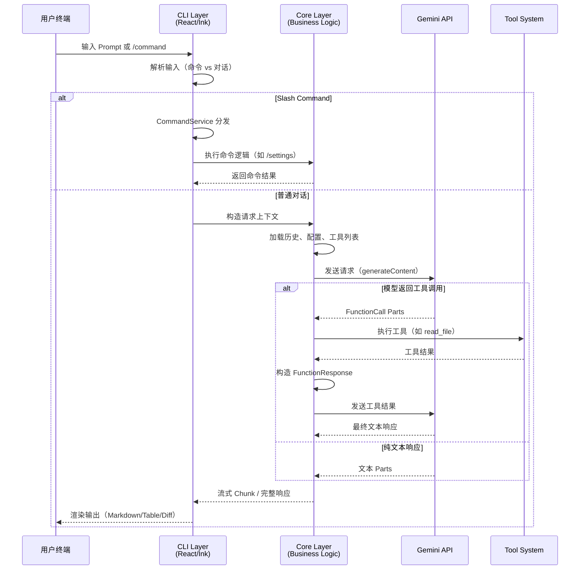

# 00 - 项目概览

**适用版本**: `0.6.0-nightly`
**Commit Hash**: `b347fa25e9133d410c4210e3825ace0cae5b4ecb` (2025-09-28)
**文档日期**: 2025-10-01

---

## 📌 项目背景

**Gemini CLI** 是 Google 官方开发的基于 Gemini API 的命令行智能助手，旨在提供：

- **交互式 AI 对话**：在终端中与 Gemini 模型进行流式对话
- **代码辅助**：通过工具（Tools）调用实现文件读写、代码搜索、Shell 执行等
- **可扩展架构**：支持自定义 Slash 命令、MCP 服务器、工具插件

### 核心能力矩阵

| 能力域 | 核心功能 | 技术实现 |
|-------|---------|---------|
| **对话** | 流式/非流式响应、上下文管理、会话压缩 | Gemini API + 重试/退避 |
| **工具** | 13 个内置工具（文件、搜索、执行、网络） | Function Calling |
| **命令** | 可插拔 Slash 命令系统（`/help`, `/tools` 等） | 自定义 CommandService |
| **配置** | 多层级配置（系统/用户/项目/环境变量） | Zod 校验 + Hierarchical Loading |
| **扩展** | MCP 服务器、自定义工具、命令插件 | Provider-Loader 模式 |
| **安全** | 沙箱执行（macOS/Docker）、权限确认 | Seatbelt/Container |

---

## 🎯 典型交互流程



---

## 🏗️ 架构概览

### 分层设计

```
┌─────────────────────────────────────────────────────────┐
│  终端用户 (stdin/stdout/stderr)                          │
└──────────────────┬──────────────────────────────────────┘
                   │
┌──────────────────▼───────────────────────────────────────┐
│  CLI Package (packages/cli/)                             │
│  ┌────────────────────────────────────────────────────┐  │
│  │ React/Ink TUI (gemini.tsx)                         │  │
│  ├────────────────────────────────────────────────────┤  │
│  │ • 命令分发 (CommandService)                        │  │
│  │ • UI 组件 (AppContainer, MessageList, Input)       │  │
│  │ • 状态管理 (Context: Settings, Session, Vim)       │  │
│  │ • 键盘处理 (Hooks: useKeypress, useCompletion)     │  │
│  └────────────────────────────────────────────────────┘  │
└──────────────────┬───────────────────────────────────────┘
                   │
┌──────────────────▼───────────────────────────────────────┐
│  Core Package (packages/core/)                           │
│  ┌────────────────────────────────────────────────────┐  │
│  │ 业务逻辑层                                          │  │
│  ├────────────────────────────────────────────────────┤  │
│  │ • geminiChat.ts (主对话循环)                       │  │
│  │ • ToolRegistry (工具注册与执行)                    │  │
│  │ • Config (配置管理)                                │  │
│  │ • Services (Git, Shell, FileSystem)               │  │
│  │ • Routing (ModelRouterService - 多模型支持)        │  │
│  └────────────────────────────────────────────────────┘  │
└──────────────────┬───────────────────────────────────────┘
                   │
┌──────────────────▼───────────────────────────────────────┐
│  External APIs & Systems                                 │
│  ┌─────────────────┐  ┌─────────────────┐  ┌──────────┐ │
│  │ Gemini API      │  │ MCP Servers     │  │ Shell    │ │
│  │ (@google/genai) │  │ (MCP SDK)       │  │ (spawn)  │ │
│  └─────────────────┘  └─────────────────┘  └──────────┘ │
└─────────────────────────────────────────────────────────┘
```

### 关键数据流

#### 1. 配置加载流程
```
启动 → parseArguments (CLI args)
     → loadSettings (User/Project/System)
     → Environment Variables (.env)
     → Config 对象初始化
     → ToolRegistry.discoverAllTools()
```

#### 2. 对话请求流程
```
用户输入 → readStdin / UI Input
        → geminiChat.sendMessage()
        → retryWithBackoff(generateContent)
        → 流式处理 (async generator)
        → 工具调用检测 (functionCall parts)
        → ToolRegistry.getTool().execute()
        → 构造 FunctionResponse
        → 重新调用模型（带工具结果）
        → 最终响应 → UI 渲染
```

---

## 🔑 核心概念

### 1. Slash Commands
- **定义**: 以 `/` 开头的特殊指令（如 `/help`, `/quit`）
- **实现**: `CommandService` + `ICommandLoader` 接口
- **扩展**: 通过 Extension 系统或自定义 Loader 添加新命令

### 2. Tools (Function Calling)
- **定义**: AI 可调用的函数（如 `read_file`, `run_shell`）
- **实现**: 基于 Gemini API 的 Function Calling 机制
- **内置**: 13 个工具（见详细列表）
- **扩展**: 继承 `DeclarativeTool` 或通过 MCP 服务器

### 3. MCP (Model Context Protocol)
- **定义**: 跨平台的 AI 工具协议标准
- **作用**: 允许外部服务提供工具/上下文给 CLI
- **配置**: `settings.json` 中的 `mcpServers` 字段

### 4. Config Hierarchy
```
系统默认值 (hardcoded)
  ↓
系统配置 (~/.gemini/settings.json)
  ↓
用户配置 (~/.gemini/settings.json)
  ↓
项目配置 (.gemini/settings.json)
  ↓
环境变量 (.env)
  ↓
CLI 参数 (--flag)
```

---

## 📊 能力边界与限制

### ✅ 当前支持
- [x] Gemini 1.5 Pro/Flash 模型
- [x] 流式/非流式响应
- [x] 13 个内置工具
- [x] MCP 服务器集成
- [x] 配置分层管理
- [x] OAuth/API Key/ADC 认证
- [x] macOS/Docker 沙箱
- [x] Vim 模式、历史记录

### ❌ 当前限制
- [ ] 多模型 Provider（OpenAI/Claude）**未完全启用**
- [ ] 工具输出超长时的智能截断（已有但可优化）
- [ ] 跨会话上下文持久化（仅支持单会话）
- [ ] 更细粒度的工具权限控制
- [ ] Windows 沙箱支持（仅 Docker/Podman）

### 🚧 实验性功能
- `useSmartEdit`: LLM 辅助修复编辑错误
- `ModelRouterService`: 多模型路由（代码存在但未默认启用）
- `A2A Server`: Agent-to-Agent 通信服务器

---

## 🎬 快速开始

### 最小启动
```bash
# 安装依赖
npm install

# 构建
npm run build

# 运行（需要 GEMINI_API_KEY）
export GEMINI_API_KEY="your_api_key"
npm start
```

### 典型使用场景
```bash
# 1. 代码问答
$ gemini
> 解释这段代码的作用
[AI 通过 read_file 工具读取文件并解释]

# 2. 执行命令
> 列出当前目录下的 TypeScript 文件
[AI 调用 run_shell 工具执行 ls *.ts]

# 3. Slash 命令
> /settings
[显示当前配置]
```

---

## 📚 后续文档导航

| 文档 | 主题 |
|------|------|
| [01-architecture.md](./01-architecture.md) | 详细架构与模块分析 |
| [02-commands.md](./02-commands.md) | 命令系统与新增模板 |
| [03-config-and-secrets.md](./03-config-and-secrets.md) | 配置管理与密钥安全 |
| [04-model-and-providers.md](./04-model-and-providers.md) | 模型层与多 Provider 设计 |
| [05-extensibility.md](./05-extensibility.md) | 扩展点与插件开发 |
| [06-dev-setup.md](./06-dev-setup.md) | 开发环境与工具链 |
| [07-testing-and-ci.md](./07-testing-and-ci.md) | 测试策略与 CI 配置 |
| [08-roadmap.md](./08-roadmap.md) | 演进路线图与风险 |

---

**下一步**: 阅读 [01-architecture.md](./01-architecture.md) 了解详细架构设计。
