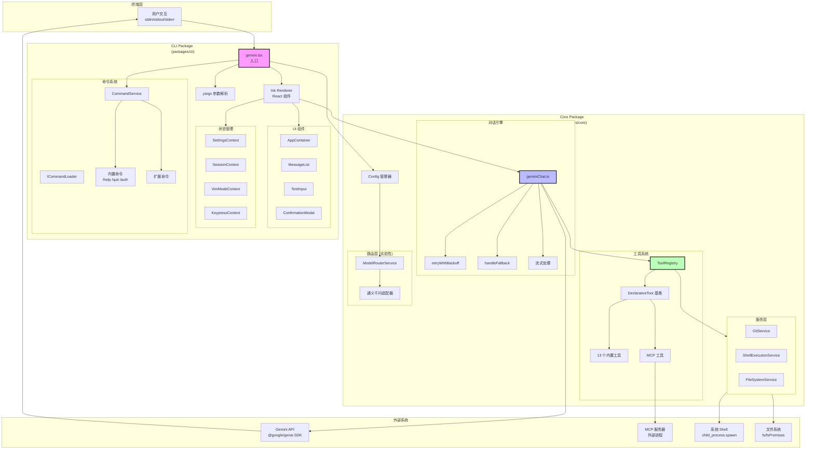
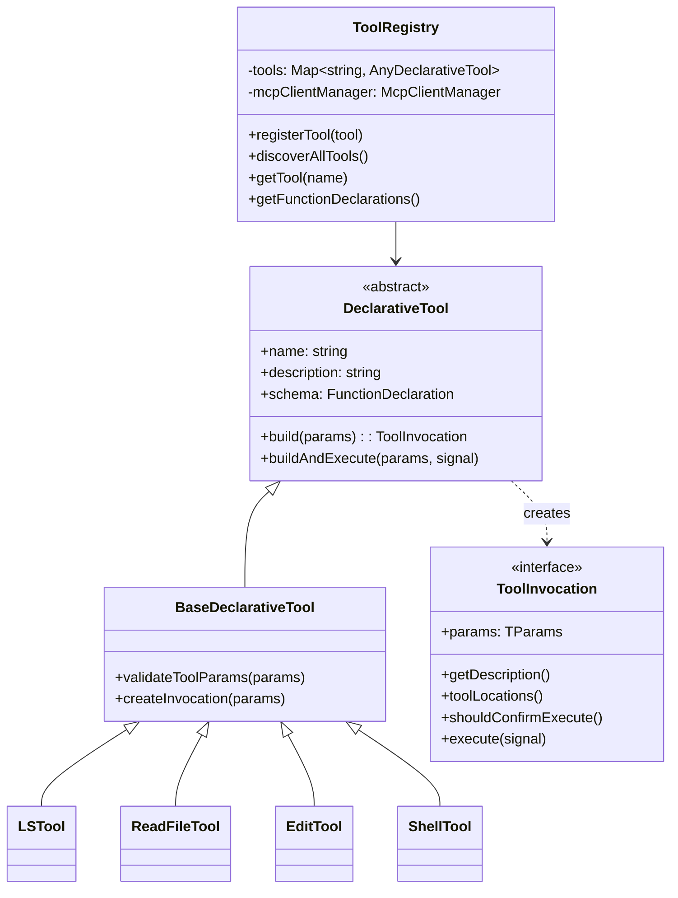
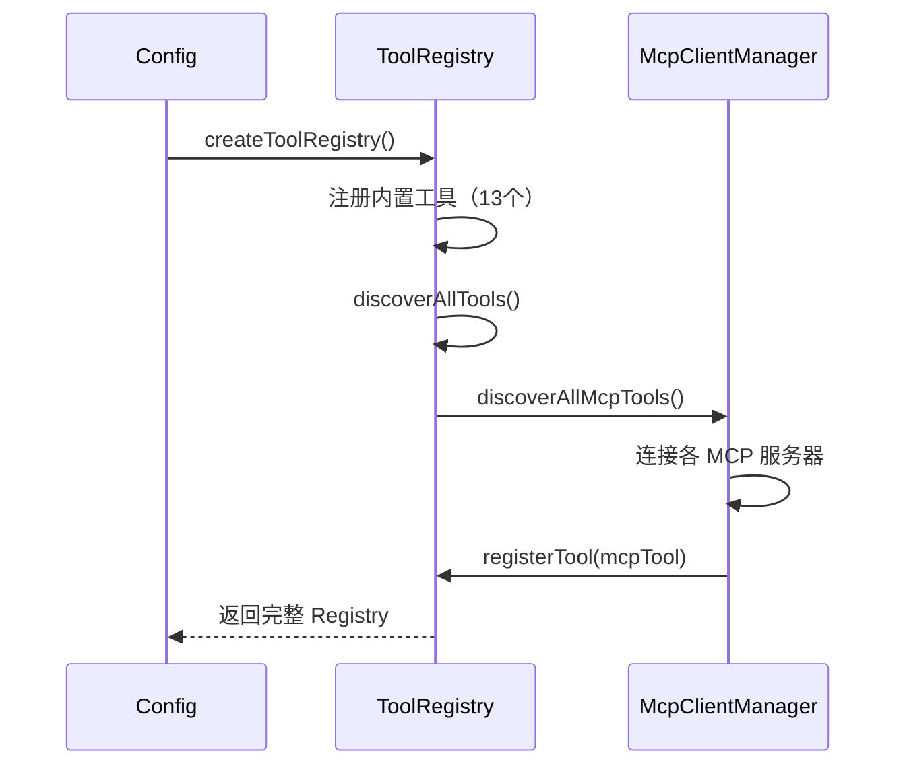
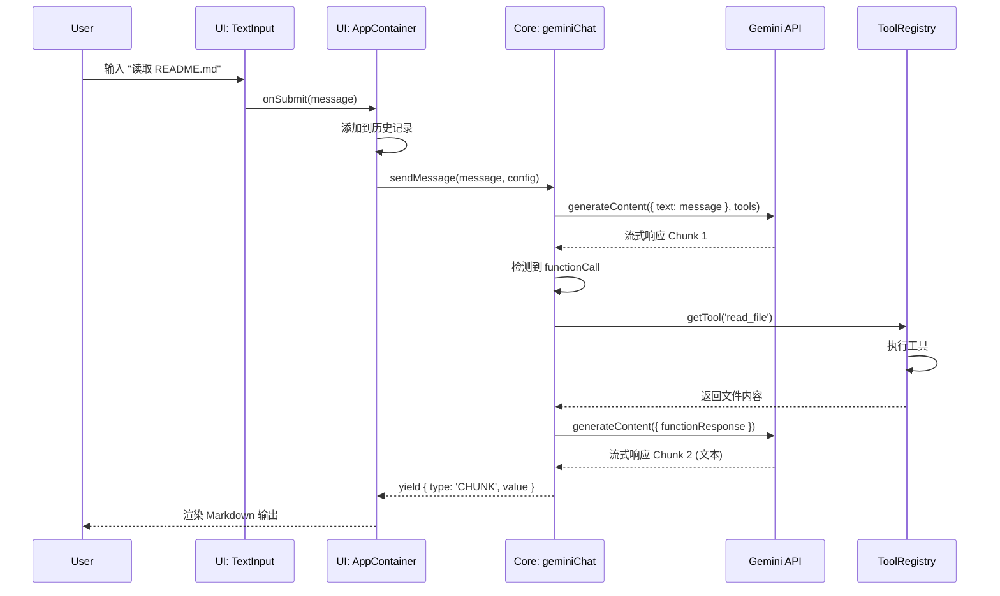
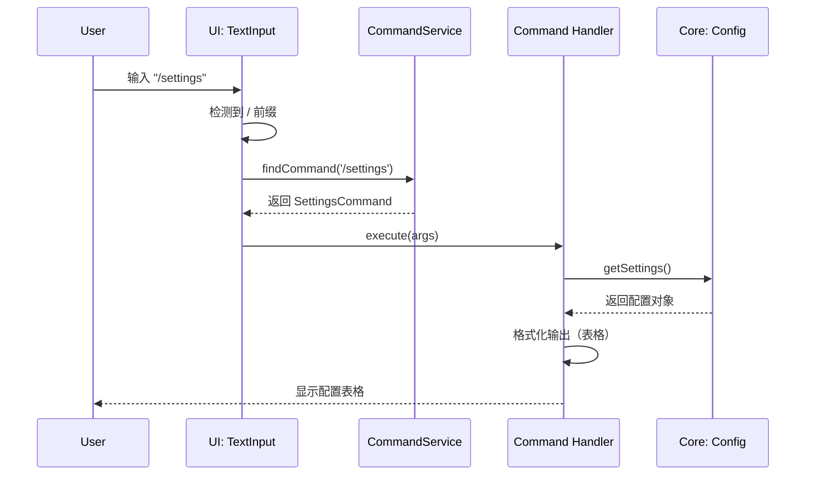
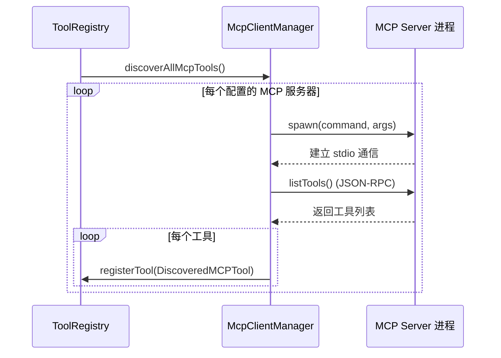
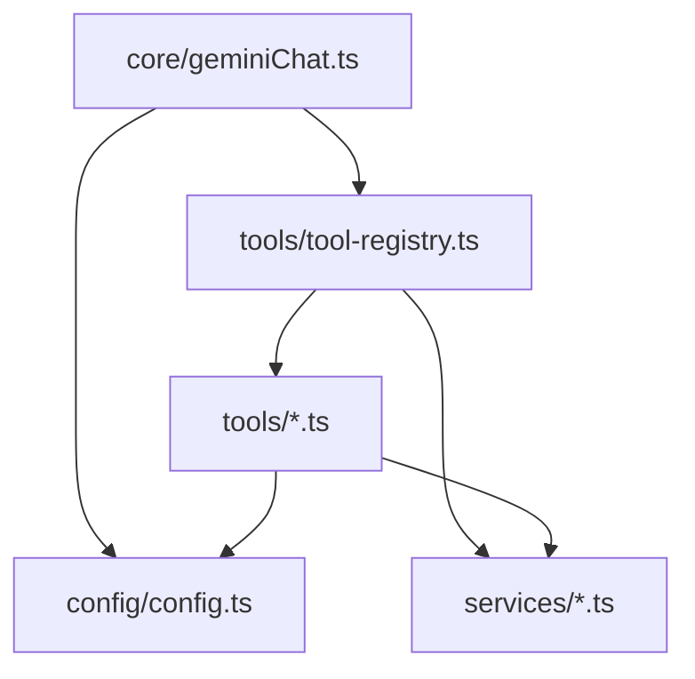

# 01 - 架构详解

**适用版本**: `0.6.0-nightly`
**Commit Hash**: `b347fa25e9133d410c4210e3825ace0cae5b4ecb`
**文档日期**: 2025-10-01

---

## 🏛️ 总体架构图



---

## 📂 模块分层详解

### Layer 1: CLI Package (表现层)

#### 入口文件: `packages/cli/src/gemini.tsx`

**核心职责**:
1. 参数解析（yargs）
2. 配置加载（Settings Hierarchy）
3. Ink 应用渲染
4. 事件监听与清理

**关键代码段**:
```typescript
// 启动流程
parseArguments()
  → loadSettings()
  → validateAuthMethod()
  → initializeApp()
  → render(<AppContainer />)
  → registerCleanup()
```

#### 命令系统: `CommandService`

**位置**: `packages/cli/src/services/CommandService.ts`

**设计模式**: Provider-Loader 模式

```typescript
interface ICommandLoader {
  loadCommands(signal: AbortSignal): Promise<SlashCommand[]>;
}

class CommandService {
  static async create(loaders: ICommandLoader[], signal: AbortSignal) {
    // 1. 并行加载所有 Loader 的命令
    // 2. 去重与冲突解决
    // 3. 返回不可变命令列表
  }

  getCommands(): readonly SlashCommand[]
}
```

**冲突解决规则**:
- 扩展命令冲突时自动重命名为 `extensionName.commandName`
- 内置命令优先级最高
- 后加载的非扩展命令覆盖先加载的同名命令

**内置命令列表**（部分）:

| 命令 | 文件 | 功能 |
|------|------|------|
| `/help` | `helpCommand.ts` | 显示帮助信息 |
| `/quit` | `quitCommand.ts` | 退出程序 |
| `/auth` | `authCommand.ts` | 认证状态管理 |
| `/settings` | `settingsCommand.ts` | 配置查看/编辑 |
| `/tools` | `toolsCommand.ts` | 工具列表 |
| `/mcp` | `mcpCommand.ts` | MCP 服务器管理 |
| `/model` | `modelCommand.ts` | 切换模型 |
| `/memory` | `memoryCommand.ts` | 查看记忆 |

#### UI 组件层

**核心组件树**:
```
<AppContainer>
  <ErrorBoundary>
    <SessionStatsProvider>
      <VimModeProvider>
        <KeypressProvider>
          <Main>
            <MessageList />
            <TextInput />
            <ToolCallDisplay />
            <ConfirmationModal />
          </Main>
        </KeypressProvider>
      </VimModeProvider>
    </SessionStatsProvider>
  </ErrorBoundary>
</AppContainer>
```

**关键 Hooks**:

| Hook | 功能 | 位置 |
|------|------|------|
| `useKeypress` | 监听键盘事件 | `hooks/useKeypress.ts` |
| `useCompletion` | Tab 补全 | `hooks/useCompletion.ts` |
| `useInputHistory` | 历史记录 | `hooks/useInputHistory.ts` |
| `useSlashCompletion` | Slash 命令补全 | `hooks/useSlashCompletion.ts` |
| `useFolderTrust` | 文件夹信任检查 | `hooks/useFolderTrust.ts` |

---

### Layer 2: Core Package (业务逻辑层)

#### 对话引擎: `geminiChat.ts`

**位置**: `packages/core/src/core/geminiChat.ts`

**核心流程**:
```typescript
async function* sendMessage(
  userMessage: string,
  config: Config
): AsyncGenerator<StreamEvent> {
  // 1. 构造请求上下文
  const contents = buildContents(history, userMessage);

  // 2. 获取工具列表
  const tools = toolRegistry.getFunctionDeclarations();

  // 3. 带重试的流式请求
  const stream = retryWithBackoff(
    () => geminiClient.generateContent(contents, { tools }),
    { maxAttempts: 3, initialDelayMs: 500 }
  );

  // 4. 逐块处理
  for await (const chunk of stream) {
    // 校验响应有效性
    if (!isValidResponse(chunk)) {
      yield { type: 'RETRY' };
      continue;
    }

    // 检测工具调用
    if (hasFunctionCalls(chunk)) {
      const results = await executeTools(chunk.functionCalls);
      // 递归调用（带工具结果）
      yield* sendMessage(buildFunctionResponse(results), config);
    } else {
      yield { type: 'CHUNK', value: chunk };
    }
  }
}
```

**重试策略**:
- **触发条件**: 网络错误、无效响应、超时
- **最大尝试次数**: 3 次（1 初始 + 2 重试）
- **退避策略**: 线性退避（500ms, 1000ms, 1500ms）
- **Fallback**: 失败后调用 `handleFallback()` 尝试其他模型

#### 工具系统: `ToolRegistry`

**位置**: `packages/core/src/tools/tool-registry.ts`

**类图**:


**工具注册时序**:


**工具分类**（按 Kind 枚举）:

| Kind | 工具 | 需要确认 |
|------|------|----------|
| `Read` | LS, ReadFile, ReadManyFiles | ❌ |
| `Search` | Grep, RipGrep, Glob | ❌ |
| `Edit` | Edit, SmartEdit, WriteFile, Memory | ✅ |
| `Execute` | Shell | ✅ |
| `Fetch` | WebFetch, WebSearch | ✅ (AUTO_EDIT 除外) |

#### 配置管理: `Config` 类

**位置**: `packages/core/src/config/config.ts`

**配置加载顺序**:
```typescript
// 1. 系统默认值
const defaultConfig = { ... };

// 2. 加载系统配置
const systemSettings = loadSettings(SettingScope.System);

// 3. 加载用户配置（覆盖系统配置）
const userSettings = loadSettings(SettingScope.User);

// 4. 加载项目配置（覆盖用户配置）
const projectSettings = loadSettings(SettingScope.Project);

// 5. 环境变量（覆盖所有文件配置）
const envConfig = {
  apiKey: process.env.GEMINI_API_KEY,
  baseUrl: process.env.GEMINI_BASE_URL,
  ...
};

// 6. CLI 参数（最高优先级）
const cliConfig = parseArguments(process.argv);

// 7. 合并所有配置
const finalConfig = new Config({
  ...defaultConfig,
  ...systemSettings,
  ...userSettings,
  ...projectSettings,
  ...envConfig,
  ...cliConfig,
});
```

**关键配置项**:

| 配置键 | 类型 | 默认值 | 说明 |
|-------|------|-------|------|
| `apiKey` | string | - | Gemini API 密钥 |
| `model` | string | `gemini-1.5-flash` | 模型名称 |
| `approvalMode` | enum | `default` | 工具确认模式 |
| `autoAccept` | string[] | `[]` | 自动批准的工具 |
| `useRipgrep` | boolean | `true` | 使用 ripgrep |
| `useSmartEdit` | boolean | `false` | 智能编辑 |
| `mcpServers` | object | `{}` | MCP 服务器配置 |

#### 服务层

##### GitService
**位置**: `packages/core/src/services/gitService.ts`

**功能**:
- 检测 Git 仓库
- 读取 .gitignore
- 获取 Git 状态/分支
- 生成 Git 差异

##### ShellExecutionService
**位置**: `packages/core/src/services/shellExecutionService.ts`

**功能**:
- 执行 Shell 命令（`spawn`）
- 流式输出捕获
- 沙箱执行（macOS Seatbelt / Docker）
- 超时控制

**沙箱执行示例**:
```typescript
// macOS Seatbelt
const sandboxArgs = [
  '-f', '/path/to/sandbox-profile.sb',
  '-D', `workspaceDir=${workspaceDir}`,
  'sh', '-c', command
];
spawn('sandbox-exec', sandboxArgs);

// Docker
spawn('docker', [
  'run', '--rm',
  '-v', `${workspaceDir}:/workspace`,
  'sandbox-image',
  'sh', '-c', command
]);
```

##### FileSystemService
**位置**: `packages/core/src/services/fileSystemService.ts`

**功能**:
- 文件读写抽象
- 权限检查
- 路径规范化
- 支持虚拟文件系统（测试用）

---

## 🔄 关键调用链路分析

### 流程 1: 用户输入到 AI 响应



### 流程 2: Slash 命令执行



### 流程 3: MCP 工具发现



---

## 📦 依赖关系图

### 包级依赖
```mermaid
graph LR
    CLI[packages/cli] --> Core[packages/core]
    CLI --> TestUtils[packages/test-utils]
    Core --> TestUtils

    CLI -.-> Ink[ink<br/>React for CLI]
    CLI -.-> Yargs[yargs<br/>参数解析]
    Core -.-> GenAI[@google/genai<br/>Gemini SDK]
    Core -.-> MCPSDK[@modelcontextprotocol/sdk]

    IntegrationTests[integration-tests] --> CLI
    IntegrationTests --> Core
```

### 模块级依赖（Core Package）


---

## 🧩 扩展点接口

### 1. 命令扩展点
```typescript
// packages/cli/src/services/types.ts
export interface ICommandLoader {
  loadCommands(signal: AbortSignal): Promise<SlashCommand[]>;
}

export interface SlashCommand {
  name: string;
  description: string;
  usage?: string;
  extensionName?: string;  // 用于冲突解决
  execute: (args: string[], signal: AbortSignal) => Promise<void>;
}
```

### 2. 工具扩展点
```typescript
// packages/core/src/tools/tools.ts
export abstract class DeclarativeTool<TParams, TResult> {
  constructor(
    readonly name: string,
    readonly description: string,
    readonly kind: Kind,
    readonly parameterSchema: unknown
  ) {}

  abstract build(params: TParams): ToolInvocation<TParams, TResult>;
}
```

### 3. 模型 Provider 扩展点
```typescript
// packages/core/src/routing/modelRouterService.ts
export interface ModelAdapter {
  generateContent(
    messages: Content[],
    options: GenerateContentConfig
  ): Promise<GenerateContentResponse>;

  generateContentStream(
    messages: Content[],
    options: GenerateContentConfig
  ): AsyncGenerator<GenerateContentResponse>;
}
```

---

## 🎯 架构评估

### ✅ 优点
1. **职责清晰**: CLI/Core 分层明确，易于测试
2. **高扩展性**: 多处扩展点（命令/工具/模型）
3. **类型安全**: 完整 TypeScript + Zod 校验
4. **可观测性**: 丰富的 Telemetry 埋点

### ⚠️ 改进点
1. **配置复杂度**: 多层级配置可能导致调试困难
   - **建议**: 增加 `gemini config dump` 命令显示最终配置
2. **模型耦合**: 当前与 Gemini API 强绑定
   - **建议**: 激活 `ModelRouterService` 实现多 Provider 支持
3. **错误处理**: 部分错误信息对用户不够友好
   - **建议**: 统一错误码体系 + 详细错误文档

---

**下一步**: 阅读 [02-commands.md](./02-commands.md) 了解命令系统详情。
