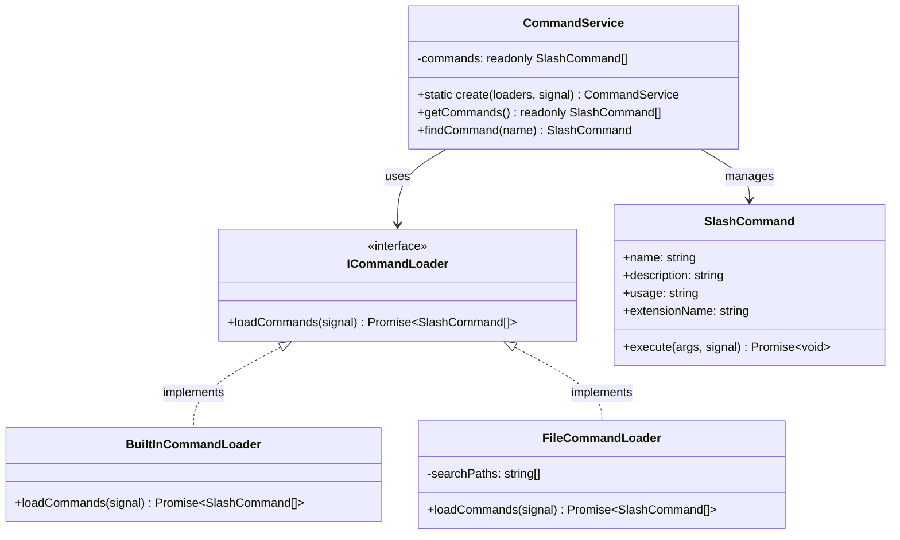
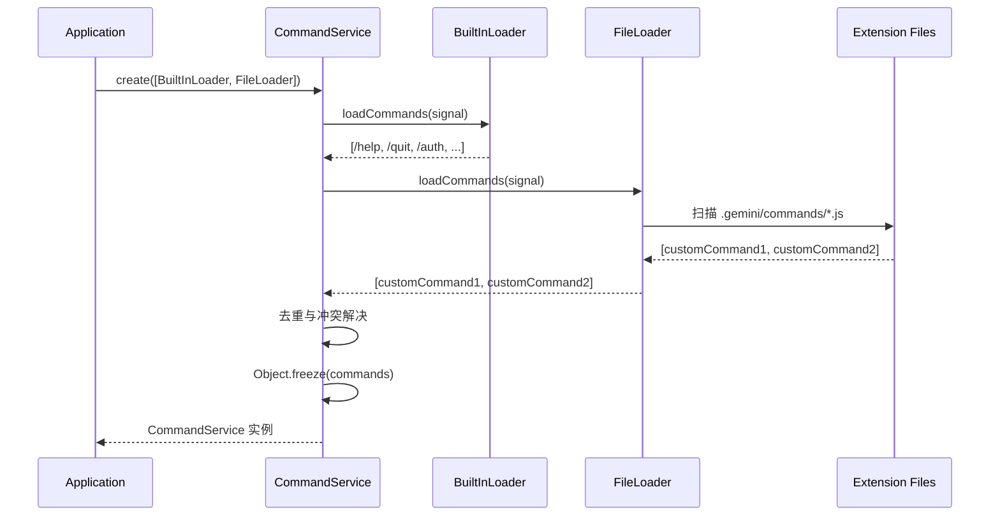

# 02 - 命令系统详解

**适用版本**: `0.6.0-nightly`
**Commit Hash**: `b347fa25e9133d410c4210e3825ace0cae5b4ecb`
**文档日期**: 2025-10-01

---

## 📌 命令系统概览

Gemini CLI 使用**自定义 Slash Commands 系统**（非传统的 CLI subcommands），命令以 `/` 开头，在交互式会话中执行特定功能。

### 核心特点
- **交互式执行**: 命令在对话过程中调用（如 `/help`, `/quit`）
- **可插拔设计**: 通过 `ICommandLoader` 接口扩展
- **冲突自动解决**: 扩展命令与内置命令重名时自动重命名
- **异步加载**: 支持从文件系统/网络动态加载

---

## 🏗️ 架构设计

### 核心类: `CommandService`

**位置**: `packages/cli/src/services/CommandService.ts`

**职责**:
1. 统一管理所有 Slash 命令
2. 协调多个命令加载器（Loader）
3. 处理命令名称冲突
4. 提供命令查询接口

**类图**:


### 命令加载流程



---

## 📚 内置命令列表

### 核心命令

| 命令 | 文件 | 功能 | 参数 |
|------|------|------|------|
| `/help` | `helpCommand.ts` | 显示帮助信息 | `[command]` - 查看特定命令帮助 |
| `/quit` | `quitCommand.ts` | 退出程序 | 无 |
| `/clear` | `clearCommand.ts` | 清空屏幕 | 无 |
| `/about` | `aboutCommand.ts` | 关于信息 | 无 |

### 配置与管理

| 命令 | 功能 | 示例 |
|------|------|------|
| `/settings` | 查看/编辑配置 | `/settings`, `/settings set model gemini-2.0-flash` |
| `/theme` | 切换主题 | `/theme dark`, `/theme light` |
| `/auth` | 认证管理 | `/auth status`, `/auth login` |
| `/vim` | 切换 Vim 模式 | `/vim on`, `/vim off` |

### 工具与扩展

| 命令 | 功能 | 示例 |
|------|------|------|
| `/tools` | 列出所有可用工具 | `/tools`, `/tools search` |
| `/mcp` | MCP 服务器管理 | `/mcp list`, `/mcp restart server1` |
| `/extensions` | 扩展管理 | `/extensions list` |
| `/memory` | 查看长期记忆 | `/memory show`, `/memory refresh` |

### 会话管理

| 命令 | 功能 | 示例 |
|------|------|------|
| `/chat` | 切换聊天会话 | `/chat new`, `/chat list` |
| `/compress` | 压缩历史上下文 | `/compress` |
| `/restore` | 恢复检查点 | `/restore` |
| `/stats` | 显示会话统计 | `/stats` |

### 开发与调试

| 命令 | 功能 | 示例 |
|------|------|------|
| `/model` | 切换模型 | `/model gemini-2.0-flash` |
| `/editor` | 打开外部编辑器 | `/editor vim` |
| `/copy` | 复制上一条消息 | `/copy` |
| `/bug` | 报告 Bug | `/bug` |

---

## 🆕 新增命令模板

### 方式 1: 创建内置命令

#### 步骤 1: 创建命令文件

**位置**: `packages/cli/src/ui/commands/diagnoseCommand.ts`

```typescript
/**
 * @license
 * Copyright 2025 Google LLC
 * SPDX-License-Identifier: Apache-2.0
 */

import type { SlashCommand } from './types.js';
import os from 'node:os';
import { execSync } from 'node:child_process';

/**
 * Diagnose 命令：检测环境配置与依赖
 */
export const diagnoseCommand: SlashCommand = {
  name: 'diagnose',
  description: '检测系统环境、依赖与 API 连接',
  usage: '/diagnose [--json]',

  async execute(args: string[], signal: AbortSignal) {
    const isJson = args.includes('--json');

    // 收集诊断信息
    const diagnostics = {
      system: {
        platform: os.platform(),
        arch: os.arch(),
        nodeVersion: process.version,
        totalMemory: `${(os.totalmem() / 1024 / 1024 / 1024).toFixed(2)} GB`,
      },
      environment: {
        hasApiKey: !!process.env.GEMINI_API_KEY,
        hasBaseUrl: !!process.env.GEMINI_BASE_URL,
        workingDirectory: process.cwd(),
      },
      dependencies: {
        git: checkCommand('git --version'),
        docker: checkCommand('docker --version'),
        ripgrep: checkCommand('rg --version'),
      },
      network: {
        canReachGoogle: await checkConnectivity('https://google.com'),
        canReachGeminiApi: await checkConnectivity(
          'https://generativelanguage.googleapis.com'
        ),
      },
    };

    // 输出格式
    if (isJson) {
      console.log(JSON.stringify(diagnostics, null, 2));
    } else {
      printTable(diagnostics);
    }
  },
};

// 辅助函数
function checkCommand(cmd: string): boolean {
  try {
    execSync(cmd, { stdio: 'ignore' });
    return true;
  } catch {
    return false;
  }
}

async function checkConnectivity(url: string): Promise<boolean> {
  try {
    const response = await fetch(url, { method: 'HEAD', signal: AbortSignal.timeout(5000) });
    return response.ok;
  } catch {
    return false;
  }
}

function printTable(data: object) {
  console.log('\n=== System Diagnostics ===\n');
  // 实现表格格式化（使用 Ink Table 或自定义）
  console.table(data);
}
```

#### 步骤 2: 注册命令

**位置**: `packages/cli/src/services/BuiltInCommandLoader.ts`（假设存在）

```typescript
import { diagnoseCommand } from '../ui/commands/diagnoseCommand.js';

export class BuiltInCommandLoader implements ICommandLoader {
  async loadCommands(signal: AbortSignal): Promise<SlashCommand[]> {
    return [
      helpCommand,
      quitCommand,
      // ... 其他命令
      diagnoseCommand, // 新增
    ];
  }
}
```

#### 步骤 3: 编写测试

**位置**: `packages/cli/src/ui/commands/diagnoseCommand.test.ts`

```typescript
import { describe, it, expect, vi } from 'vitest';
import { diagnoseCommand } from './diagnoseCommand.js';

describe('diagnoseCommand', () => {
  it('should export a valid SlashCommand', () => {
    expect(diagnoseCommand.name).toBe('diagnose');
    expect(diagnoseCommand.description).toBeTruthy();
    expect(typeof diagnoseCommand.execute).toBe('function');
  });

  it('should execute without API key and show warning', async () => {
    const consoleSpy = vi.spyOn(console, 'log');
    delete process.env.GEMINI_API_KEY;

    await diagnoseCommand.execute([], new AbortController().signal);

    expect(consoleSpy).toHaveBeenCalled();
    // 验证输出包含警告信息
  });

  it('should output JSON format when --json flag is provided', async () => {
    const consoleSpy = vi.spyOn(console, 'log');

    await diagnoseCommand.execute(['--json'], new AbortController().signal);

    const output = consoleSpy.mock.calls[0][0];
    expect(() => JSON.parse(output)).not.toThrow();
  });
});
```

---

### 方式 2: 创建扩展命令

#### 步骤 1: 创建扩展文件

**位置**: `.gemini/commands/custom.js`（用户项目目录）

```javascript
// ESM 格式
export const commands = [
  {
    name: 'deploy',
    description: 'Deploy the application',
    usage: '/deploy [environment]',
    async execute(args, signal) {
      const env = args[0] || 'staging';
      console.log(`Deploying to ${env}...`);

      // 调用部署脚本
      const { spawn } = await import('node:child_process');
      const proc = spawn('npm', ['run', `deploy:${env}`]);

      return new Promise((resolve, reject) => {
        proc.on('close', (code) => {
          if (code === 0) {
            console.log('Deployment successful!');
            resolve();
          } else {
            reject(new Error(`Deployment failed with code ${code}`));
          }
        });
      });
    },
  },
];
```

#### 步骤 2: 配置加载路径

**位置**: `.gemini/settings.json`

```json
{
  "extensionPaths": [
    ".gemini/commands"
  ]
}
```

#### 步骤 3: 加载扩展

扩展命令会在 `FileCommandLoader` 中自动发现并加载。冲突时会重命名为 `extensionName.commandName`。

---

## 🔧 命令开发规范

### 命令命名约定

| 规则 | 说明 | 示例 |
|------|------|------|
| **小写字母** | 命令名全部小写 | `/help` ✅  `/Help` ❌ |
| **短横线分隔** | 多词命令用 `-` 连接 | `/setup-github` ✅  `/setupGithub` ❌ |
| **简洁明了** | 名称不超过 20 字符 | `/diagnose` ✅  `/run-system-diagnostics` ❌ |

### 参数处理

```typescript
export const myCommand: SlashCommand = {
  name: 'example',
  usage: '/example [--flag1] [--flag2 value] <required>',

  async execute(args: string[], signal: AbortSignal) {
    // 1. 解析标志参数
    const hasFlag1 = args.includes('--flag1');
    const flag2Index = args.indexOf('--flag2');
    const flag2Value = flag2Index >= 0 ? args[flag2Index + 1] : null;

    // 2. 解析位置参数
    const positionalArgs = args.filter(arg => !arg.startsWith('--'));
    const required = positionalArgs[0];

    if (!required) {
      throw new Error('Missing required argument');
    }

    // 3. 校验与执行
    // ...
  },
};
```

### 错误处理

```typescript
export const robustCommand: SlashCommand = {
  async execute(args, signal) {
    try {
      // 1. 参数校验
      if (args.length === 0) {
        throw new Error('At least one argument is required');
      }

      // 2. 执行主逻辑
      const result = await doSomething(args[0]);

      // 3. 成功输出
      console.log(`Success: ${result}`);

    } catch (error) {
      // 4. 错误输出（用户友好）
      if (error instanceof Error) {
        console.error(`Error: ${error.message}`);
      } else {
        console.error('An unexpected error occurred');
      }

      // 5. 退出码（非交互模式）
      process.exitCode = 1;
    }
  },
};
```

### 信号处理（取消支持）

```typescript
export const cancellableCommand: SlashCommand = {
  async execute(args, signal) {
    const operation = performLongTask();

    // 监听取消信号
    signal.addEventListener('abort', () => {
      operation.cancel();
      console.log('Command cancelled by user');
    });

    await operation;
  },
};
```

---

## 🎨 输出格式规范

### 表格输出（推荐用于列表）

```typescript
import Table from 'ink-table';
import { render, Text } from 'ink';

function displayTable(data: Array<Record<string, unknown>>) {
  render(
    <Table data={data} />
  );
}
```

### Markdown 输出（用于长文本）

```typescript
import { Markdown } from './ui/components/Markdown.js';

function displayMarkdown(content: string) {
  render(
    <Markdown content={content} />
  );
}
```

### JSON 输出（用于编程接口）

```typescript
if (args.includes('--json')) {
  console.log(JSON.stringify(result, null, 2));
} else {
  // 人类可读格式
  displayTable(result);
}
```

---

## 🧪 测试策略

### 单元测试

```typescript
describe('myCommand', () => {
  it('should parse arguments correctly', async () => {
    const result = await myCommand.execute(['arg1', '--flag'], signal);
    expect(result).toBeDefined();
  });

  it('should throw error on invalid input', async () => {
    await expect(myCommand.execute([], signal)).rejects.toThrow();
  });

  it('should respect abort signal', async () => {
    const controller = new AbortController();
    const promise = myCommand.execute(['long-task'], controller.signal);

    setTimeout(() => controller.abort(), 100);

    await expect(promise).rejects.toThrow('aborted');
  });
});
```

### 集成测试

```typescript
import { CommandService } from './CommandService.js';
import { myCommandLoader } from './loaders/myCommandLoader.js';

describe('CommandService Integration', () => {
  it('should load and execute custom command', async () => {
    const service = await CommandService.create(
      [myCommandLoader],
      new AbortController().signal
    );

    const command = service.findCommand('myCommand');
    expect(command).toBeDefined();

    await command.execute([], new AbortController().signal);
  });
});
```

---

## 📖 命令帮助系统

### 自动生成帮助

```typescript
export const helpCommand: SlashCommand = {
  async execute(args, signal) {
    const commandName = args[0];

    if (commandName) {
      // 显示特定命令的帮助
      const command = this.commandService.findCommand(commandName);
      if (command) {
        console.log(`Command: /${command.name}`);
        console.log(`Description: ${command.description}`);
        if (command.usage) {
          console.log(`Usage: ${command.usage}`);
        }
      } else {
        console.error(`Unknown command: ${commandName}`);
      }
    } else {
      // 显示所有命令列表
      const commands = this.commandService.getCommands();
      console.log('Available commands:');
      commands.forEach(cmd => {
        console.log(`  /${cmd.name.padEnd(20)} - ${cmd.description}`);
      });
    }
  },
};
```

---

## 🔒 安全考虑

### 1. 输入校验
```typescript
// 防止命令注入
const sanitizedArg = args[0].replace(/[;&|]/, '');
```

### 2. 权限检查
```typescript
if (command.requiresElevated && !hasPermission()) {
  throw new Error('This command requires elevated permissions');
}
```

### 3. 沙箱执行
```typescript
// 对于执行外部命令的 Slash Command
if (config.getSandboxMode()) {
  await executeSandboxed(command);
}
```

---

## 📈 性能优化

### 延迟加载命令

```typescript
export class LazyCommandLoader implements ICommandLoader {
  async loadCommands(signal: AbortSignal): Promise<SlashCommand[]> {
    return [
      {
        name: 'heavy',
        description: 'Heavy command (lazy loaded)',
        async execute(args, signal) {
          // 只在执行时才导入重型依赖
          const { heavyFunction } = await import('./heavy-module.js');
          return heavyFunction(args);
        },
      },
    ];
  }
}
```

---

## 🎯 最佳实践总结

| 实践 | 说明 |
|------|------|
| **幂等性** | 命令多次执行应产生相同结果 |
| **原子性** | 失败时应回滚所有变更 |
| **反馈及时** | 长时间操作应显示进度 |
| **错误友好** | 错误信息应明确且可操作 |
| **文档齐全** | 每个命令都应有 usage 和 description |
| **测试覆盖** | 至少覆盖正常流程和错误情况 |

---

**下一步**: 阅读 [03-config-and-secrets.md](./03-config-and-secrets.md) 了解配置管理。
