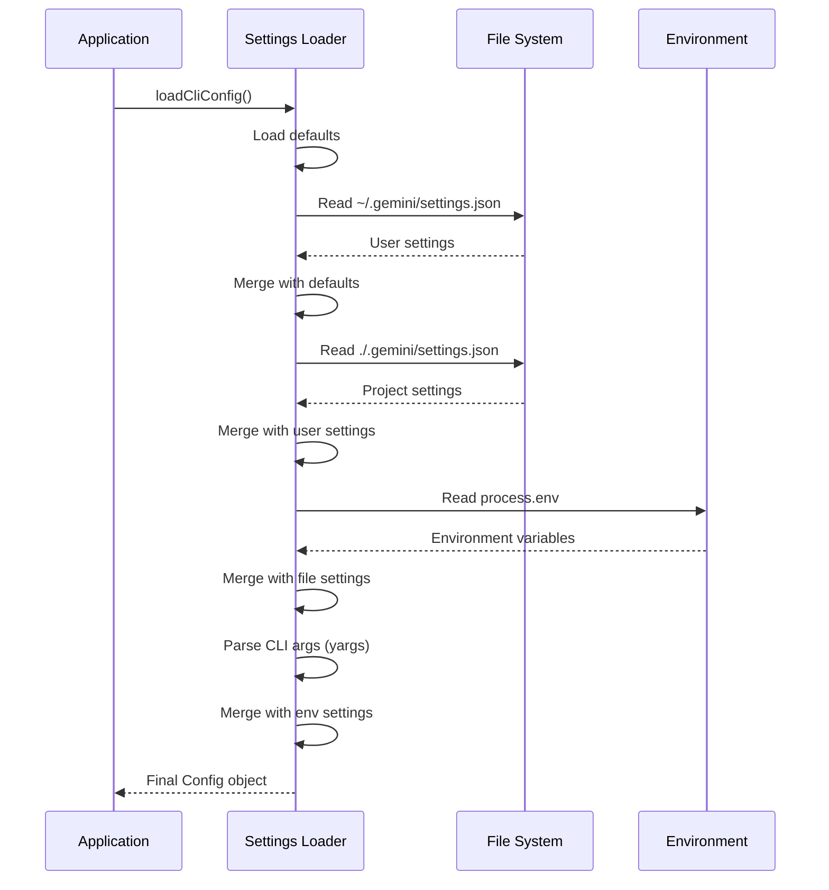

# 03 - 配置与密钥管理

**适用版本**: `0.6.0-nightly`
**Commit Hash**: `b347fa25e9133d410c4210e3825ace0cae5b4ecb`
**文档日期**: 2025-10-01

---

## 📌 配置体系概览

Gemini CLI 采用**分层配置系统**，支持多种配置来源，优先级从低到高：

```
1. 硬编码默认值 (DEFAULT_*)
   ↓
2. 系统配置 (/etc/gemini/settings.json - Linux/macOS)
   ↓
3. 用户配置 (~/.gemini/settings.json)
   ↓
4. 项目配置 (.gemini/settings.json)
   ↓
5. 环境变量 (.env 文件或 export)
   ↓
6. CLI 参数 (--flag)
```

---

## 🗂️ 配置文件格式

### 标准配置文件: `settings.json`

**位置**:
- 用户级: `~/.gemini/settings.json`
- 项目级: `.gemini/settings.json`

**示例**:
```json
{
  "$schema": "https://github.com/google-gemini/gemini-cli/blob/main/packages/cli/config-schema.json",
  "model": "gemini-2.0-flash",
  "apiKey": "${GEMINI_API_KEY}",
  "approvalMode": "default",
  "autoAccept": [
    "read_file",
    "ls",
    "glob",
    "grep"
  ],
  "coreTools": [
    "read_file",
    "write_file",
    "edit",
    "run_shell",
    "web_search"
  ],
  "useRipgrep": true,
  "useSmartEdit": false,
  "mcpServers": {
    "filesystem": {
      "command": "npx",
      "args": ["-y", "@modelcontextprotocol/server-filesystem", "/path/to/workspace"],
      "autoApprove": ["read_file", "list_directory"]
    }
  },
  "theme": "dark",
  "vimMode": false,
  "dnsResolutionOrder": "ipv4first"
}
```

### 环境变量配置: `.env`

**位置**: 项目根目录或 `~/.gemini/.env`

**示例**:
```bash
# API 认证
GEMINI_API_KEY=AIzaSyXXXXXXXXXXXXXXXXXXXXXXXXX
GEMINI_BASE_URL=https://generativelanguage.googleapis.com

# 代理设置
HTTP_PROXY=http://proxy.example.com:8080
HTTPS_PROXY=http://proxy.example.com:8080
NO_PROXY=localhost,127.0.0.1

# 调试选项
DEBUG=1
GEMINI_SANDBOX=false
GEMINI_CLI_NO_RELAUNCH=1

# 模型路由（实验性）
USE_MODEL_ROUTER=true
QWEN_CODER_API_KEY=sk-xxxxxxxx
QWEN_CODER_BASE_URL=https://dashscope.aliyuncs.com/compatible-mode/v1
```

---

## 🔑 密钥管理

### 认证方式

| 方式 | 优先级 | 使用场景 | 配置方法 |
|------|--------|---------|---------|
| **API Key** | 高 | 个人开发 | 环境变量 `GEMINI_API_KEY` |
| **OAuth** | 中 | 企业账号 | `gemini auth login` |
| **ADC** | 低 | GCP 环境 | `gcloud auth application-default login` |

### 安全最佳实践

#### 1. 不要硬编码密钥
```json
// ❌ 危险：硬编码密钥
{
  "apiKey": "AIzaSyXXXXXXXXXXXXXXXXXXXXXXXXX"
}

// ✅ 推荐：引用环境变量
{
  "apiKey": "${GEMINI_API_KEY}"
}
```

#### 2. 使用 `.gitignore`
```.gitignore
# 环境变量
.env
.env.local

# 配置文件（如果包含敏感信息）
.gemini/settings.json

# OAuth 令牌
.gemini/.credentials
```

#### 3. `.env.example` 模板
```bash
# Gemini API 配置
GEMINI_API_KEY=your_api_key_here

# 可选：自定义 API 端点
# GEMINI_BASE_URL=https://custom-endpoint.com

# 可选：代理配置
# HTTP_PROXY=http://proxy:8080
# HTTPS_PROXY=http://proxy:8080
```

---

## 📋 完整配置项参考

### 核心配置

| 配置键 | 类型 | 默认值 | 说明 |
|-------|------|-------|------|
| `model` | string | `gemini-1.5-flash` | 默认模型名称 |
| `apiKey` | string | - | API 密钥（或环境变量引用） |
| `baseUrl` | string | `https://generativelanguage.googleapis.com` | API 端点 |
| `timeout` | number | `300000` | 请求超时（毫秒） |
| `maxRetries` | number | `3` | 最大重试次数 |

### 工具配置

| 配置键 | 类型 | 默认值 | 说明 |
|-------|------|-------|------|
| `coreTools` | string[] | `null` | 启用的核心工具列表（null 表示全部） |
| `excludeTools` | string[] | `[]` | 禁用的工具列表 |
| `autoAccept` | string[] | `[]` | 自动批准的工具（无需确认） |
| `useRipgrep` | boolean | `true` | 使用 ripgrep 代替 grep |
| `useSmartEdit` | boolean | `false` | 启用智能编辑 |

### 行为配置

| 配置键 | 类型 | 默认值 | 说明 |
|-------|------|-------|------|
| `approvalMode` | enum | `default` | `default`, `autoEdit`, `yolo` |
| `sandbox` | string/boolean | `false` | `false`, `docker`, `podman`, `seatbelt` |
| `workspaceDir` | string | `process.cwd()` | 工作目录 |
| `contextFileNames` | string[] | `["GEMINI.md"]` | 上下文文件名 |

### UI 配置

| 配置键 | 类型 | 默认值 | 说明 |
|-------|------|-------|------|
| `theme` | string | `dark` | 主题名称 |
| `vimMode` | boolean | `false` | 启用 Vim 模式 |
| `screenReader` | boolean | `false` | 无障碍模式 |
| `disableLoadingPhrases` | boolean | `false` | 禁用加载动画 |

### 网络配置

| 配置键 | 类型 | 默认值 | 说明 |
|-------|------|-------|------|
| `proxy` | string | - | HTTP/HTTPS 代理 |
| `noProxy` | string | - | 不代理的域名列表 |
| `dnsResolutionOrder` | enum | `ipv4first` | `ipv4first`, `verbatim` |

---

## 🛠️ 配置加载流程

### 代码流程

```typescript
// packages/cli/src/config/settings.ts

export enum SettingScope {
  System = 'system',    // /etc/gemini/
  User = 'user',        // ~/.gemini/
  Project = 'project',  // ./.gemini/
}

export function loadSettings(scope: SettingScope): LoadedSettings {
  const configPath = getConfigPath(scope);

  if (!fs.existsSync(configPath)) {
    return {};
  }

  const rawContent = fs.readFileSync(configPath, 'utf-8');
  const parsed = JSON.parse(stripJsonComments(rawContent));

  // 解析环境变量引用 ${VAR_NAME}
  return resolveEnvVariables(parsed);
}

function resolveEnvVariables(obj: any): any {
  if (typeof obj === 'string') {
    return obj.replace(/\$\{([^}]+)\}/g, (_, varName) => {
      return process.env[varName] || '';
    });
  }
  if (typeof obj === 'object' && obj !== null) {
    for (const key in obj) {
      obj[key] = resolveEnvVariables(obj[key]);
    }
  }
  return obj;
}
```

### 加载顺序图



---

## 🔐 密钥存储方案

### 方案 1: 环境变量（推荐）

```bash
# ~/.bashrc 或 ~/.zshrc
export GEMINI_API_KEY="AIzaSyXXXXXXXXXXXXXXXXXXXXXXXXX"
```

**优点**:
- ✅ 不会泄漏到 Git
- ✅ 跨项目共享
- ✅ 易于 CI/CD 集成

**缺点**:
- ❌ 明文存储在 shell 配置中
- ❌ 子进程可见

### 方案 2: 加密密钥库（高级）

```bash
# 使用 macOS Keychain
security add-generic-password -a "$USER" -s "gemini-api-key" -w "AIzaSy..."

# 在启动脚本中读取
export GEMINI_API_KEY=$(security find-generic-password -a "$USER" -s "gemini-api-key" -w)
```

### 方案 3: OAuth（企业推荐）

```bash
# 首次登录
gemini auth login

# 令牌存储位置
~/.gemini/.credentials

# 自动刷新令牌
# 无需手动管理 API Key
```

---

## 🧪 配置验证

### 验证命令（未来实现）

```bash
# 验证配置文件格式
gemini config validate

# 显示最终合并的配置
gemini config dump

# 测试 API 连接
gemini config test-connection
```

### 手动验证

```typescript
import { z } from 'zod';

const configSchema = z.object({
  model: z.string().min(1),
  apiKey: z.string().optional(),
  approvalMode: z.enum(['default', 'autoEdit', 'yolo']),
  autoAccept: z.array(z.string()).default([]),
  // ... 更多字段
});

type Config = z.infer<typeof configSchema>;

function validateConfig(raw: unknown): Config {
  return configSchema.parse(raw);
}
```

---

## 🐛 常见问题排查

### 问题 1: API Key 未生效

**症状**: 提示 "API key not configured"

**排查**:
```bash
# 1. 检查环境变量
echo $GEMINI_API_KEY

# 2. 检查配置文件
cat ~/.gemini/settings.json | grep apiKey

# 3. 验证加载顺序
gemini --debug  # 查看日志
```

### 问题 2: 配置被意外覆盖

**原因**: 多层级配置优先级混淆

**解决**:
```bash
# 查看最终配置
gemini /settings

# 删除冲突的配置
mv .gemini/settings.json .gemini/settings.json.bak
```

### 问题 3: 代理配置无效

**症状**: 无法访问 API

**排查**:
```bash
# 检查代理环境变量
env | grep -i proxy

# 测试代理连接
curl -x $HTTP_PROXY https://generativelanguage.googleapis.com

# 临时禁用代理
unset HTTP_PROXY HTTPS_PROXY
```

---

## 📚 配置模板示例

### 最小配置
```json
{
  "apiKey": "${GEMINI_API_KEY}"
}
```

### 开发环境配置
```json
{
  "model": "gemini-1.5-flash",
  "approvalMode": "autoEdit",
  "autoAccept": ["read_file", "ls", "glob", "grep"],
  "sandbox": false,
  "theme": "dark",
  "vimMode": true
}
```

### 生产环境配置
```json
{
  "model": "gemini-2.0-flash",
  "approvalMode": "default",
  "autoAccept": [],
  "sandbox": "docker",
  "useRipgrep": true,
  "timeout": 60000,
  "maxRetries": 5
}
```

---

**下一步**: 阅读 [04-model-and-providers.md](./04-model-and-providers.md) 了解模型层设计。
