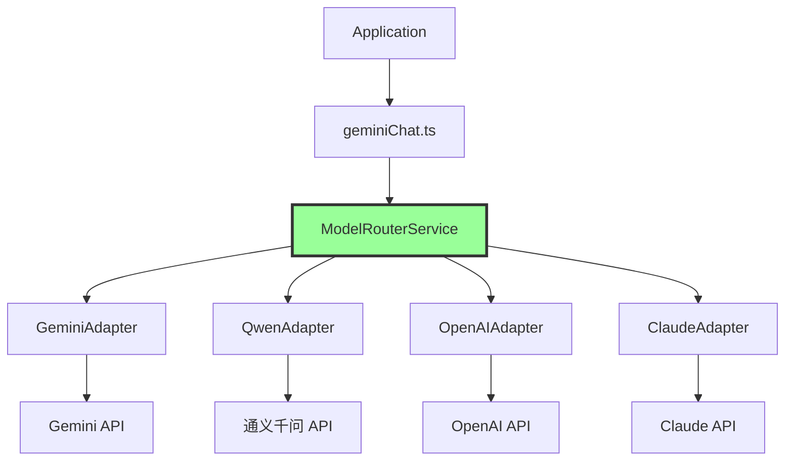

# 04 - 模型与 Provider 架构

**适用版本**: `0.6.0-nightly`
**Commit Hash**: `b347fa25e9133d410c4210e3825ace0cae5b4ecb`
**文档日期**: 2025-10-01

---

## 📌 当前状态

### 现有实现
- **默认 Provider**: Google Gemini API (`@google/genai` SDK)
- **支持模型**:
  - `gemini-1.5-flash` (默认)
  - `gemini-1.5-pro`
  - `gemini-2.0-flash-exp`
  - 其他 Gemini 系列模型

### 实验性功能
- **ModelRouterService**: 多模型路由框架（代码存在但未完全激活）
- **通义千问适配器**: 部分代码已实现但需完善

---

## 🏗️ 架构设计

### 当前架构（Gemini 单一 Provider）

```mermaid
graph TB
    App[Application] --> Chat[geminiChat.ts]
    Chat --> Client[GeminiClient]
    Client --> SDK[@google/genai SDK]
    SDK --> API[Gemini API]

    style API fill:#f96,stroke:#333
```

### 目标架构（多 Provider 支持）



---

## 🔌 ModelAdapter 接口设计

### 核心接口

```typescript
// packages/core/src/routing/types.ts

export interface ModelAdapter {
  /**
   * 模型唯一标识符
   */
  readonly name: string;

  /**
   * 非流式生成
   */
  generateContent(
    messages: Content[],
    options: GenerateContentConfig
  ): Promise<GenerateContentResponse>;

  /**
   * 流式生成
   */
  generateContentStream(
    messages: Content[],
    options: GenerateContentConfig
  ): AsyncGenerator<GenerateContentResponse>;

  /**
   * 健康检查
   */
  healthCheck(): Promise<boolean>;

  /**
   * 获取模型元数据
   */
  getMetadata(): ModelMetadata;
}

export interface ModelMetadata {
  name: string;
  provider: string;
  contextWindow: number;
  maxOutputTokens: number;
  supportsFunctionCalling: boolean;
  supportsVision: boolean;
  pricing?: {
    inputPer1M: number;
    outputPer1M: number;
  };
}
```

### Gemini Adapter 实现（现有）

```typescript
// packages/core/src/routing/gemini-adapter.ts

export class GeminiAdapter implements ModelAdapter {
  constructor(
    private readonly client: GeminiClient,
    private readonly model: string
  ) {}

  async generateContent(
    messages: Content[],
    options: GenerateContentConfig
  ): Promise<GenerateContentResponse> {
    return this.client.generateContent(messages, options);
  }

  async *generateContentStream(
    messages: Content[],
    options: GenerateContentConfig
  ): AsyncGenerator<GenerateContentResponse> {
    const stream = await this.client.generateContentStream(messages, options);
    for await (const chunk of stream) {
      yield chunk;
    }
  }

  async healthCheck(): Promise<boolean> {
    try {
      await this.client.generateContent(
        [{ role: 'user', parts: [{ text: 'test' }] }],
        { maxOutputTokens: 1 }
      );
      return true;
    } catch {
      return false;
    }
  }

  getMetadata(): ModelMetadata {
    return {
      name: this.model,
      provider: 'google',
      contextWindow: 1_048_576, // 1M tokens
      maxOutputTokens: 8192,
      supportsFunctionCalling: true,
      supportsVision: true,
    };
  }
}
```

---

## 🚀 ModelRouterService（路由层）

### 核心功能

```typescript
// packages/core/src/routing/modelRouterService.ts

export class ModelRouterService {
  private adapters: Map<string, ModelAdapter> = new Map();

  /**
   * 注册 Adapter
   */
  registerAdapter(adapter: ModelAdapter): void {
    this.adapters.set(adapter.name, adapter);
  }

  /**
   * 根据模型名称路由请求
   */
  async routeRequest(
    modelName: string,
    messages: Content[],
    options: GenerateContentConfig,
    streaming: boolean = false
  ): Promise<GenerateContentResponse | AsyncGenerator> {
    const adapter = this.adapters.get(modelName);

    if (!adapter) {
      throw new Error(`Unknown model: ${modelName}`);
    }

    if (streaming) {
      return adapter.generateContentStream(messages, options);
    } else {
      return adapter.generateContent(messages, options);
    }
  }

  /**
   * Fallback 机制：主模型失败时尝试备用模型
   */
  async requestWithFallback(
    primaryModel: string,
    fallbackModels: string[],
    messages: Content[],
    options: GenerateContentConfig
  ): Promise<GenerateContentResponse> {
    const models = [primaryModel, ...fallbackModels];

    for (const model of models) {
      try {
        return await this.routeRequest(model, messages, options, false) as GenerateContentResponse;
      } catch (error) {
        console.warn(`Model ${model} failed, trying next...`);
        if (model === models[models.length - 1]) {
          throw error; // 所有模型都失败
        }
      }
    }

    throw new Error('All models failed');
  }
}
```

---

## 🔧 新增 Provider 实现指南

### 示例：OpenAI Adapter

```typescript
// packages/core/src/routing/openai-adapter.ts

import OpenAI from 'openai';
import type { Content, GenerateContentResponse, Part } from '@google/genai';

export class OpenAIAdapter implements ModelAdapter {
  private client: OpenAI;

  constructor(apiKey: string, baseURL?: string) {
    this.client = new OpenAI({ apiKey, baseURL });
  }

  async generateContent(
    messages: Content[],
    options: GenerateContentConfig
  ): Promise<GenerateContentResponse> {
    // 1. 转换格式：Gemini Content → OpenAI Messages
    const openaiMessages = this.convertToOpenAIMessages(messages);

    // 2. 转换工具定义
    const tools = this.convertTools(options.tools);

    // 3. 调用 OpenAI API
    const response = await this.client.chat.completions.create({
      model: 'gpt-4-turbo',
      messages: openaiMessages,
      tools: tools,
      max_tokens: options.maxOutputTokens,
      temperature: options.temperature,
    });

    // 4. 转换响应：OpenAI Response → Gemini Response
    return this.convertToGeminiResponse(response);
  }

  async *generateContentStream(
    messages: Content[],
    options: GenerateContentConfig
  ): AsyncGenerator<GenerateContentResponse> {
    const stream = await this.client.chat.completions.create({
      model: 'gpt-4-turbo',
      messages: this.convertToOpenAIMessages(messages),
      stream: true,
    });

    for await (const chunk of stream) {
      yield this.convertChunkToGeminiResponse(chunk);
    }
  }

  // 格式转换辅助方法
  private convertToOpenAIMessages(contents: Content[]): OpenAI.ChatCompletionMessageParam[] {
    return contents.map(content => ({
      role: content.role === 'model' ? 'assistant' : content.role,
      content: this.extractText(content.parts),
    }));
  }

  private extractText(parts: Part[]): string {
    return parts
      .filter(p => 'text' in p)
      .map(p => (p as any).text)
      .join('');
  }

  private convertToGeminiResponse(openaiResp: any): GenerateContentResponse {
    return {
      candidates: [
        {
          content: {
            role: 'model',
            parts: [{ text: openaiResp.choices[0].message.content }],
          },
          finishReason: 'STOP',
          index: 0,
        },
      ],
      usageMetadata: {
        promptTokenCount: openaiResp.usage.prompt_tokens,
        candidatesTokenCount: openaiResp.usage.completion_tokens,
        totalTokenCount: openaiResp.usage.total_tokens,
      },
    };
  }

  async healthCheck(): Promise<boolean> {
    try {
      await this.client.models.retrieve('gpt-4-turbo');
      return true;
    } catch {
      return false;
    }
  }

  getMetadata(): ModelMetadata {
    return {
      name: 'gpt-4-turbo',
      provider: 'openai',
      contextWindow: 128000,
      maxOutputTokens: 4096,
      supportsFunctionCalling: true,
      supportsVision: true,
      pricing: {
        inputPer1M: 10.0,
        outputPer1M: 30.0,
      },
    };
  }
}
```

---

## 🔁 重试与超时策略

### 当前实现

```typescript
// packages/core/src/utils/retry.ts

export async function retryWithBackoff<T>(
  fn: () => Promise<T>,
  options: {
    maxAttempts: number;
    initialDelayMs: number;
    backoffFactor?: number; // 默认 2（指数退避）
  }
): Promise<T> {
  let lastError: Error;

  for (let attempt = 0; attempt < options.maxAttempts; attempt++) {
    try {
      return await fn();
    } catch (error) {
      lastError = error as Error;

      if (attempt === options.maxAttempts - 1) {
        throw lastError;
      }

      const delay = options.initialDelayMs * Math.pow(options.backoffFactor ?? 2, attempt);
      await sleep(delay);
    }
  }

  throw lastError!;
}
```

### 配置重试参数

```typescript
// 在 Config 中添加重试配置
export interface RetryConfig {
  maxAttempts: number;
  initialDelayMs: number;
  backoffFactor: number;
  retryableErrors: string[]; // 只重试特定错误
}

const defaultRetryConfig: RetryConfig = {
  maxAttempts: 3,
  initialDelayMs: 500,
  backoffFactor: 2,
  retryableErrors: [
    'RATE_LIMIT_EXCEEDED',
    'INTERNAL_ERROR',
    'DEADLINE_EXCEEDED',
  ],
};
```

---

## 🌐 Fallback 机制

### 当前实现

```typescript
// packages/core/src/fallback/handler.ts

export async function handleFallback(
  config: Config,
  primaryError: Error,
  messages: Content[],
  options: GenerateContentConfig
): Promise<GenerateContentResponse> {
  const fallbackModels = config.getFallbackModels();

  for (const model of fallbackModels) {
    try {
      console.log(`Trying fallback model: ${model}`);
      return await generateWithModel(model, messages, options);
    } catch (error) {
      console.warn(`Fallback model ${model} also failed`);
    }
  }

  throw new Error(`All models failed. Original error: ${primaryError.message}`);
}
```

### 配置 Fallback

```json
{
  "model": "gemini-2.0-flash",
  "fallbackModels": [
    "gemini-1.5-flash",
    "gemini-1.5-pro"
  ]
}
```

---

## 🔍 模型选择策略

### 按任务类型选择

```typescript
export function selectModelForTask(task: TaskType, config: Config): string {
  const modelMapping: Record<TaskType, string> = {
    'code-generation': 'gemini-2.0-flash',
    'long-context': 'gemini-1.5-pro',
    'fast-response': 'gemini-1.5-flash',
    'vision': 'gemini-1.5-pro',
  };

  return modelMapping[task] || config.getDefaultModel();
}
```

### 按成本优化

```typescript
export function selectCheapestModel(config: Config): string {
  const models = config.getAvailableModels();
  return models.reduce((cheapest, current) => {
    const cheapestPrice = cheapest.pricing.inputPer1M + cheapest.pricing.outputPer1M;
    const currentPrice = current.pricing.inputPer1M + current.pricing.outputPer1M;
    return currentPrice < cheapestPrice ? current : cheapest;
  }).name;
}
```

---

## 📊 可观测性

### 请求日志

```typescript
export async function loggedGenerateContent(
  adapter: ModelAdapter,
  messages: Content[],
  options: GenerateContentConfig
): Promise<GenerateContentResponse> {
  const startTime = Date.now();

  try {
    const response = await adapter.generateContent(messages, options);
    const duration = Date.now() - startTime;

    // 记录成功请求
    telemetry.log({
      event: 'model_request_success',
      model: adapter.name,
      duration,
      inputTokens: response.usageMetadata?.promptTokenCount,
      outputTokens: response.usageMetadata?.candidatesTokenCount,
    });

    return response;
  } catch (error) {
    // 记录失败请求
    telemetry.log({
      event: 'model_request_failure',
      model: adapter.name,
      duration: Date.now() - startTime,
      error: (error as Error).message,
    });

    throw error;
  }
}
```

---

## 🎯 最小可行实现：通义千问适配器

### 实现目标
- 支持通义千问 Qwen-Coder 模型
- 实现基础对话功能（无工具调用）
- 集成到 ModelRouterService

### 代码实现

```typescript
// packages/core/src/routing/qwen-adapter.ts

import type { Content, GenerateContentResponse } from '@google/genai';

export class QwenAdapter implements ModelAdapter {
  readonly name = 'qwen-coder-turbo';
  private readonly baseURL: string;
  private readonly apiKey: string;

  constructor(config: { apiKey: string; baseURL?: string }) {
    this.apiKey = config.apiKey;
    this.baseURL = config.baseURL || 'https://dashscope.aliyuncs.com/compatible-mode/v1';
  }

  async generateContent(
    messages: Content[],
    options: GenerateContentConfig
  ): Promise<GenerateContentResponse> {
    const response = await fetch(`${this.baseURL}/chat/completions`, {
      method: 'POST',
      headers: {
        'Content-Type': 'application/json',
        'Authorization': `Bearer ${this.apiKey}`,
      },
      body: JSON.stringify({
        model: 'qwen-coder-turbo',
        messages: this.convertMessages(messages),
        max_tokens: options.maxOutputTokens,
        temperature: options.temperature || 0.7,
      }),
    });

    if (!response.ok) {
      throw new Error(`Qwen API error: ${response.statusText}`);
    }

    const data = await response.json();
    return this.convertResponse(data);
  }

  async *generateContentStream(
    messages: Content[],
    options: GenerateContentConfig
  ): AsyncGenerator<GenerateContentResponse> {
    const response = await fetch(`${this.baseURL}/chat/completions`, {
      method: 'POST',
      headers: {
        'Content-Type': 'application/json',
        'Authorization': `Bearer ${this.apiKey}`,
      },
      body: JSON.stringify({
        model: 'qwen-coder-turbo',
        messages: this.convertMessages(messages),
        stream: true,
      }),
    });

    const reader = response.body!.getReader();
    const decoder = new TextDecoder();

    while (true) {
      const { done, value } = await reader.read();
      if (done) break;

      const chunk = decoder.decode(value);
      const lines = chunk.split('\n').filter(line => line.startsWith('data: '));

      for (const line of lines) {
        if (line.includes('[DONE]')) continue;
        const data = JSON.parse(line.slice(6));
        yield this.convertStreamChunk(data);
      }
    }
  }

  private convertMessages(contents: Content[]): any[] {
    return contents.map(c => ({
      role: c.role === 'model' ? 'assistant' : c.role,
      content: c.parts.map(p => (p as any).text).join(''),
    }));
  }

  private convertResponse(qwenResp: any): GenerateContentResponse {
    return {
      candidates: [
        {
          content: {
            role: 'model',
            parts: [{ text: qwenResp.choices[0].message.content }],
          },
          finishReason: 'STOP',
          index: 0,
        },
      ],
      usageMetadata: {
        promptTokenCount: qwenResp.usage?.prompt_tokens || 0,
        candidatesTokenCount: qwenResp.usage?.completion_tokens || 0,
        totalTokenCount: qwenResp.usage?.total_tokens || 0,
      },
    };
  }

  private convertStreamChunk(chunk: any): GenerateContentResponse {
    return {
      candidates: [
        {
          content: {
            role: 'model',
            parts: [{ text: chunk.choices[0].delta.content || '' }],
          },
          finishReason: chunk.choices[0].finish_reason === 'stop' ? 'STOP' : 'ONGOING',
          index: 0,
        },
      ],
    };
  }

  async healthCheck(): Promise<boolean> {
    try {
      await this.generateContent(
        [{ role: 'user', parts: [{ text: 'hi' }] }],
        { maxOutputTokens: 1 }
      );
      return true;
    } catch {
      return false;
    }
  }

  getMetadata(): ModelMetadata {
    return {
      name: 'qwen-coder-turbo',
      provider: 'qwen',
      contextWindow: 8192,
      maxOutputTokens: 2048,
      supportsFunctionCalling: false,
      supportsVision: false,
    };
  }
}
```

---

**下一步**: 阅读 [05-extensibility.md](./05-extensibility.md) 了解扩展方案。
